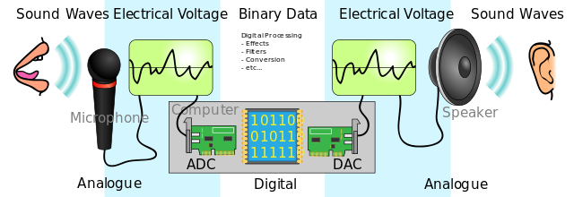
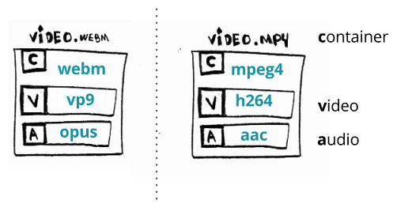

# 音视频基础知识

- [音视频基础知识](#音视频基础知识)
  - [视频--你可以看得见什么](#视频--你可以看得见什么)
  - [音频--你可以听到什么](#音频--你可以听到什么)
    - [声音三要素](#声音三要素)
    - [声音采集](#声音采集)
  - [编解码 - 压缩数据](#编解码---压缩数据)
  - [容器 - 整合音视频的地方](#容器---整合音视频的地方)

## 视频--你可以看得见什么

视频的基础概念：一组图片（或者称为帧）以特定运行速率的滚动。

## 音频--你可以听到什么

声音是指压力波通过空气或者任何其他介质（例如气体、液体或者固体）传播的震动。



人耳听觉范围（Hz 一秒中震动的次数）：

次声波  |20Hz|  可听声波 |20kHz| 超声波

### 声音三要素

1. 音调：音频的快慢  男生 --> 女生 --> 儿童（快）。
2. 音量：震动的幅度。
3. 音色：谐波。

### 声音采集

1. 量化采样：对一段模拟音频进行数字量化采样转换为数字信号。
2. 位深（采样大小）：采样能表述的最大范围值。8bit 或 16bit。位深越大声音描述越好。
3. 采样率：采样的频率就是采样率(1s 采样次数 8k、16K、32K、44.1K、48K)。
4. 声道：单声道、双声道、多声道。
5. PCM 数据：最常见的原始数字数据存储格式。
   - PCM 数据大小：`采样大小 * 采样率 * 声道`。例如：采样率为 44.1 KHz，采样大小为 16bit，双声道的 PCM 编码 WAV 文件，它的码率为 **44.1K * 16 * 2 = 1411.2Kb/s**。
6. WAV 数据：既可以存储原始 PCM 数据，再 PCM基础上加一个头信息。或者存储压缩数据。
   - [WAV HEADER](https://www.jianshu.com/p/63d7aa88582b)

## 编解码 - 压缩数据

>CODEC 是一种压缩或解压缩数字音频/视频的电子软件。 它将原始（未压缩的）数字音频/视频转换为压缩格式，反之亦然。
>
>[Video_codec 维基百科介绍](https://en.wikipedia.org/wiki/Video_codec)

如果没有编解码会发生什么：我们打包数百万张图片到一个电影时，我们会获得一个很大的文件。

假如我们创建一个1080x1920 (高x宽)的视频，每个像素有 3 bytes，每秒 24 帧(每秒播放 24 张图片，这些图片给我们 16,777,216 种不同的颜色)，视频时长为 30 分钟。

```cpp
toppf = 1080 * 1920 //每帧所有的像素点
cpp = 3 //每个像素的大小
tis = 30 * 60 //时长秒
fps = 24 //每秒帧数

required_storage = tis * fps * toppf * cpp
```

个视频需要大约 250.28G 的存储空间，1.11Gbps 的带宽播放才能不卡顿。这就是我们为什么需要编解码的原因。

> 具体视频编解码技术学习可参考 [digital_video_introduction](https://github.com/leandromoreira/digital_video_introduction/blob/master/README-cn.md)

## 容器 - 整合音视频的地方

> 容器或称为封装格式描述了不同的数据元素和元数据是如何结合一起的。
>
> [Wiki———Digital_container_format](https://en.wikipedia.org/wiki/Digital_container_format)

一个文件包含了所有的流（有音频和视频），并且也提供了**音视频同步和通用元数据同步的方式**，比如标题、分辨率等等。通常我们可以通过文件的后缀来判断文件格式。


