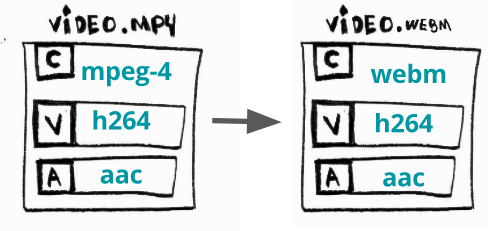

# FFmpeg 概览

- [FFmpeg 概览](#ffmpeg-概览)
  - [FFmpeg - 命令行](#ffmpeg---命令行)
    - [FFmpeg 命令行工具介绍](#ffmpeg-命令行工具介绍)
  - [通用的音视频操作](#通用的音视频操作)
    - [音频采集&播放](#音频采集播放)
    - [转码](#转码)
    - [转格式（封装）](#转格式封装)
    - [转码率](#转码率)
    - [转分辨率](#转分辨率)
    - [自适应流](#自适应流)
  - [超越](#超越)

## FFmpeg - 命令行

FFmpeg 提供了强大的命令行工具，例如，如下命令可以将一个 mp4 格式转换到 avi 格式：

```shell
~/WorkSpace/NoteBook_FFmpegLearning/other master*
❯ ffmpeg -i small_bunny_1080p_60fps.mp4 output.avi
```

### FFmpeg 命令行工具介绍

具体命令行使用可以参考：[官方文档](https://www.ffmpeg.org/ffmpeg.html)

这里简单概述下，FFmpeg 命令行分为几个参数：

- `ffmpeg {1} {2} -i {3} {4} {5}`
  1. 全局参数
  2. 输入参数
  3. 输入内容
  4. 输出选项
  5. 输出内容

2、3、4、5 可根据自己的需求添加参数，例如下例：

```shell
$ ffmpeg \
-y \ # 全局参数
-c:a libfdk_aac -c:v libx264 \ # 输入选项
-i bunny_1080p_60fps.mp4 \ # 输入内容
-c:v libvpx-vp9 -c:a libvorbis \ # 输出选项
bunny_1080p_60fps_vp9.webm # 输出内容
```

这个命令行作用是转换一个 mp4 文件（包含了 aac 格式的音频流，h264 编码格式的视频流），我们将它转换为 webm，并且改变了音视频的编码格式。同时也可以简化命令行，FFmpeg 会猜测你的意图，执行 `ffmpeg -i input.avi output.mp4` 命令 ffmpeg 便会使用默认参数将 avi 转换为 mp4。

[有关于 ffmpeg 编码和编辑的教程](http://slhck.info/ffmpeg-encoding-course/#/)

## 通用的音视频操作

通常对音视频做操作表示为编解码，其包含了一系列的动作。

### 音频采集&播放

Mac:通过 avfoundation 组件采集音视频（不同的系统采集接口不同），-i :0 只采集音频，存在 out.wav。

```shell
sudo ffmpeg -f avfoundation -i :0 out.wav
ffplay out.wav
```

### 转码


转码表示将一个视频流或音频流从一个编码格式转换到另一个格式。

转码的原因大多数由于有些设备不支持 X 编码，但是对 Y 编码或者更新的编码方式有更好的支持或者其他的编码方式可以提供更好的压缩比。

ffmpeg 可以通过以下示例命令进行转码，将 H264(AVC) 转到 H265(HEVC)

```shell
~/WorkSpace/NoteBook_FFmpegLearning/other master*
❯ ffmpeg -i small_bunny_1080p_60fps.mp4 -c:v libx265 small_bunny_1080p_60fps_h265.mp4
```

### 转格式（封装）



转格式表示将视频从某一个格式（容器）转换成另外一个。

转格式的原因：有时候有些设备（TV，智能手机，游戏机等等）已经不支持 X ，但是支持 Y 和一些新的容器提供了更现代的特征。

ffmpeg 可以通过以下示例命令将一个 mp4 转为 webm：

```cpp
$ ffmpeg \
-i bunny_1080p_60fps.mp4 \
-c copy \ # 告诉ffmpeg跳过编解码的过程
bunny_1080p_60fps.webm
```

### 转码率


视频码率：kb/s，是指视频文件在单位时间内使用的数据流量，也叫码流率。码率越大，说明单位时间内取样率越大，数据流精度就越高。

转码率将会改变视频码率。

转码率的目的：人们尝试用手机 2G 的网络来观看视频，也有用 4K 的电视来观看视频，我们需要提供不同的码率来满足不同的需求。

我们通常使用改变码率和改变大小的编解码操作，另一篇文章可以参考：[关于 FFmpeg 码率控制](https://slhck.info/posts/)

```shell
❯ffmpeg \
-i small_bunny_1080p_60fps.mp4 \
-minrate 964K -maxrate 3856K -bufsize 2000k \
small_bunny_1080p_60fps_tran_964_2856.mp4
```

### 转分辨率


为了提供不同的分辨率来满足不同的需求，通过转分辨率可以转换不同的分辨率。

通过以下命令将 1080p 转成 480p：

```shell
❯ ffmpeg \
-i small_bunny_1080p_60fps.mp4 \
-vf scale=480:-1 \
small_bunny_1080p_60fps_transsizing_480.mp4
```

### 自适应流


自适应流可以通过生成很多不同分辨率的视频，并且把视频切分成块文件，最终通过 http 来分发不同分辨率的视频块。

主要是为了提供一个更加灵活的观看体验在不同的终端和网络环境，比如用智能手机或者 4K 电视都能轻松的调整码率观看。

使用 DASH 创建一个自适应的 WebM。[有关 WebM 自适应使用说明](http://wiki.webmproject.org/adaptive-streaming/instructions-to-playback-adaptive-webm-using-dash)。

```shell
# 视频流
$ ffmpeg -i bunny_1080p_60fps.mp4 -c:v libvpx-vp9 -s 160x90 -b:v 250k -keyint_min 150 -g 150 -an -f webm -dash 1 video_160x90_250k.webm

$ ffmpeg -i bunny_1080p_60fps.mp4 -c:v libvpx-vp9 -s 320x180 -b:v 500k -keyint_min 150 -g 150 -an -f webm -dash 1 video_320x180_500k.webm

$ ffmpeg -i bunny_1080p_60fps.mp4 -c:v libvpx-vp9 -s 640x360 -b:v 750k -keyint_min 150 -g 150 -an -f webm -dash 1 video_640x360_750k.webm

$ ffmpeg -i bunny_1080p_60fps.mp4 -c:v libvpx-vp9 -s 640x360 -b:v 1000k -keyint_min 150 -g 150 -an -f webm -dash 1 video_640x360_1000k.webm

$ ffmpeg -i bunny_1080p_60fps.mp4 -c:v libvpx-vp9 -s 1280x720 -b:v 1500k -keyint_min 150 -g 150 -an -f webm -dash 1 video_1280x720_1500k.webm

# 音频流
$ ffmpeg -i bunny_1080p_60fps.mp4 -c:a libvorbis -b:a 128k -vn -f webm -dash 1 audio_128k.webm

# DASH 格式
$ ffmpeg \
 -f webm_dash_manifest -i video_160x90_250k.webm \
 -f webm_dash_manifest -i video_320x180_500k.webm \
 -f webm_dash_manifest -i video_640x360_750k.webm \
 -f webm_dash_manifest -i video_640x360_1000k.webm \
 -f webm_dash_manifest -i video_1280x720_500k.webm \
 -f webm_dash_manifest -i audio_128k.webm \
 -c copy -map 0 -map 1 -map 2 -map 3 -map 4 -map 5 \
 -f webm_dash_manifest \
 -adaptation_sets "id=0,streams=0,1,2,3,4 id=1,streams=5" \
 manifest.mpd
```

## 超越

这里有很多 FFmpeg 其他的用途很多 FFmpeg [其他的用途](https://github.com/leandromoreira/digital_video_introduction/blob/master/encoding_pratical_examples.md#split-and-merge-smoothly)。
