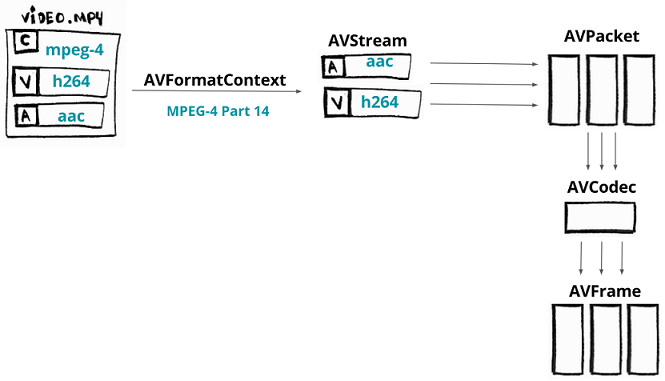

# FFmpeg 库使用技巧

- [FFmpeg 库使用技巧](#ffmpeg-库使用技巧)
  - [HelloWorld](#helloworld)
    - [FFmpeg libav 架构](#ffmpeg-libav-架构)
    - [代码一览](#代码一览)

FFmpeg 命令行工具已经提供了许多强大的功能，同时 FFmpeg 也可以是通过库集成到我们的程序中。

## HelloWorld

这里并不是输出 ”HelloWorld" 而是 **输出视频信息** ，信息包括：时长、分辨率、音频轨道。**最后我们将解码一些帧，并且保存为图片。**

```shell
~/WorkSpace/NoteBook_FFmpegLearning/LibFFmpegUsingExample LibFFmpegUsing*
❯ ./build/HelloWorld ./small_bunny_1080p_60fps.mp4
LOG: initializing all the containers, codecs and protocols.
LOG: opening the input file (./small_bunny_1080p_60fps.mp4) and loading format (container) header
LOG: format mov,mp4,m4a,3gp,3g2,mj2, duration 2022000 us, bit_rate 0
LOG: finding stream info from format
LOG: AVStream->time_base before open coded 1/15360
LOG: AVStream->r_frame_rate before open coded 60/1
LOG: AVStream->start_time 0
LOG: AVStream->duration 30720
LOG: finding the proper decoder (CODEC)
LOG: AVPacket->pts 0
LOG: AVPacket->pts 1024
LOG: AVPacket->pts 512
LOG: Frame 1 (type=I, size=100339 bytes, format=0) pts 0 key_frame 1 [DTS 0]
LOG: AVPacket->pts 256
LOG: Frame 2 (type=B, size=7484 bytes, format=0) pts 256 key_frame 0 [DTS 3]
LOG: AVPacket->pts 768
LOG: Frame 3 (type=B, size=14764 bytes, format=0) pts 512 key_frame 0 [DTS 2]
LOG: AVPacket->pts 2048
LOG: Frame 4 (type=B, size=7058 bytes, format=0) pts 768 key_frame 0 [DTS 4]
LOG: AVPacket->pts 1536
LOG: Frame 5 (type=P, size=37353 bytes, format=0) pts 1024 key_frame 0 [DTS 1]
LOG: AVPacket->pts 1280
LOG: Frame 6 (type=B, size=8678 bytes, format=0) pts 1280 key_frame 0 [DTS 7]
LOG: releasing all the resources
```

### FFmpeg libav 架构

FFmpeg libav 架构流程以及各个组件之间的工作方式如下图:



就此工作流程以下分步介绍：

1. 加载媒体文件到 [AVFormatContext](https://link.zhihu.com/?target=https%3A//ffmpeg.org/doxygen/trunk/structAVFormatContext.html) 组件（容器可以理解为视频文件格式），它并不是真正的加载整个文件，它只是加载了文件头。
   - 首先加载了容器的头信息，这样就可以访问媒体文件流（流表示最基本的音视频数据）。每个流对于 [AVStream](https://ffmpeg.org/doxygen/trunk/structAVStream.html) 都是有用的。
2. 假设我们的视频文件有两个流：一个 AAC 的音频流，一个 H264(AVC) 的视频流。可以将每一个流中的数据包加载到 [AVPacket](https://ffmpeg.org/doxygen/trunk/structAVPacket.html)。
3. 数据包中的数据仍然是被编码的，为了解码这些数据，需要将数据送到 [AVCodec](https://ffmpeg.org/doxygen/trunk/structAVCodec.html)。
4. AVCodec 将解压这些数据到 [AVFrame](https://ffmpeg.org/doxygen/trunk/structAVFrame.html)，最后我们将得到解码后的帧。这个处理流程适用于视频流和音频流。

### 代码一览

[参考代码](../../LibFFmpegUsingExample/Src/00_libav_tutoria/00_HelloWorld.cpp)

大致流程如下：

1. 首先为保存获取到的容器 AVFormatContext 分配内存：

    ```cpp
    AVFormatContext *pFormatContext = avformat_alloc_context();
    ```

2. 我们将打开一个文件，利用 AVFormatContext 来读取文件的头信息。打开文件常用的方法  avformat_open_input。avformat_open_input 需要参数 AVFormatContext，媒体文件和两个参数，如果 AVInputFormat 为 NULL，FFmpeg 将猜测格式。AVDictionary 参数（是一个解封装参数）：

    ```cpp
    avformat_open_input(&pFormatContext, filename, NULL, NULL);
    ```

3. 获取到的信息中包括视频格式和时长：

    ```cpp
    avformat_find_stream_info(pFormatContext,  NULL);
    ```

4. 为了访问数据流，我们需要从媒体文件中读取数据。函数 avformat_find_stream_info 是做这个的。pFormatContext->nb_streams 将获取所有的流信息，并且通过 pFormatContext->streams[i] 获取到指定的流数据(AVStream)：

    ```cpp
    avformat_find_stream_info(pFormatContext,  NULL);
    ```

5. 使用循环来获取所有流数据：

    ```cpp
    for (int i = 0; i < pFormatContext->nb_streams; i++)
    {
    //
    }
    ```

6. 每一个流都是 AVCodecParameters 类，这个类描述了流的编码属性：

    ```cpp
    AVCodecParameters *pLocalCodecParameters = pFormatContext->streams[i]->codecpar;
    ```

7. 我们通过 avcodec_find_decoder 来查看编码的属性，这个函数不仅能找到codec id，并且会返回 AVCodec类型的变量，这个组件能让我们知道如何去编解码这个流：

    ```cpp
    AVCodec *pLocalCodec = avcodec_find_decoder(pLocalCodecParameters->codec_id);
    ```

8. 我们现在可以打印一些 codecs 的信息：

    ```cpp
    // when the stream is a video we store its index, codec parameters and codec
    if (pLocalCodecParameters->codec_type == AVMEDIA_TYPE_VIDEO)
    {
        if (video_stream_index == -1)
        {
            video_stream_index = i;
            pCodec = pLocalCodec;
            pCodecParameters = pLocalCodecParameters;
            break;
        }

        logging("Video Codec: resolution %d x %d", pLocalCodecParameters->width,
            pLocalCodecParameters->height);
    }
    else if (pLocalCodecParameters->codec_type == AVMEDIA_TYPE_AUDIO)
    {
        logging("Audio Codec: %d channels, sample rate %d", pLocalCodecParameters->channels,
            pLocalCodecParameters->sample_rate);
    }

    // print its name, id and bitrate
    logging("\tCodec %s ID %d bit_rate %lld", pLocalCodec->name, pLocalCodec->id,
        pLocalCodecParameters->bit_rate);
    ```

9. 当我们编解码的时候，我们首先要为 AVCodecContext 分配内存，因为我们存放处理解码/编码的内容。 然后我们使用 avcodec_parameters_to_context 来为 AVCodecContext 赋值，当我们完成赋值，我们就可以调用 avcodec_open2 来使用这个变量了：

    ```cpp
    AVCodecContext *pCodecContext = avcodec_alloc_context3(pCodec);
    avcodec_parameters_to_context(pCodecContext, pCodecParameters);
    avcodec_open2(pCodecContext, pCodec, NULL);
    ```

10. 首先我们要为 AVPacket 和 AVFrame 来分配内存，然后我们将从流中读取数据包并且解码数据包为帧数据：

    ```cpp
    AVPacket *pPacket = av_packet_alloc();
    AVFrame *pFrame = av_frame_alloc();
    ```

11. 我们使用函数 av_read_frame 来填充包数据：

    ```cpp
    while (av_read_frame(pFormatContext, pPacket) >= 0) {
    //...
    }
    ```

12. 我们使用函数 avcodec_send_packet 来把原数据包（未解码的帧）发送给解码器：

    ```cpp
    avcodec_send_packet(pCodecContext, pPacket);
    ```

13. 我们使用函数 avcodec_receive_frame 来接受原数据帧（解压后的帧）从解码器。

    ```cpp
    avcodec_receive_frame(pCodecContext, pFrame);
    ```

14. 我们可以打印 frame 的编号，包括 PTS、DTS、frame 类型等等都可以打印。

    ```cpp
    printf(
        "Frame %c (%d) pts %d dts %d key_frame %d [coded_picture_number %d, display_picture_number %d]",
        av_get_picture_type_char(pFrame->pict_type),
        pCodecContext->frame_number,
        pFrame->pts,
        pFrame->pkt_dts,
        pFrame->key_frame,
        pFrame->coded_picture_number,
        pFrame->display_picture_number
    );
    ```

15. 最后我们可以保存我们解码出来的帧到一个简单的灰色图片。这个处理过程非常简单，我们使用 pFrame->data 查看 planes Y, Cb and Cr 相关数据，但是我们只取0（Y）数据保存为灰色图片。

    ```cpp
    save_gray_frame(pFrame->data[0], pFrame->linesize[0], pFrame->width, pFrame->height, frame_filename);

    static void save_gray_frame(unsigned char *buf, int wrap, int xsize, int ysize, char *filename)
    {
        FILE *f;
        int i;
        f = fopen(filename,"w");
        // writing the minimal required header for a pgm file format
        // portable graymap format -> https://en.wikipedia.org/wiki/Netpbm_format#PGM_example
        fprintf(f, "P5\n%d %d\n%d\n", xsize, ysize, 255);

        // writing line by line
        for (i = 0; i < ysize; i++)
            fwrite(buf + i * wrap, 1, xsize, f);
        fclose(f);
    }
    ```

现在我们有一张2MB大小的图片：


