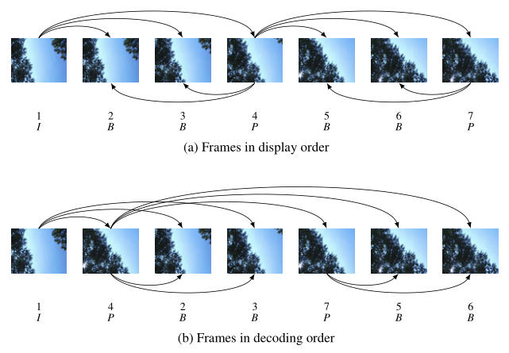

# FFmpeg 之音视频同步

- [FFmpeg 之音视频同步](#ffmpeg-之音视频同步)
  - [初识时间线](#初识时间线)
  - [I、P、B 以及 DTS 、PTS 解析](#ipb-以及-dts-pts-解析)
    - [I 帧、P 帧、B 帧、GOP](#i-帧p-帧b-帧gop)
    - [PTS 与 DTS](#pts-与-dts)

## 初识时间线

时间线，或者说播放器如何知道在正确的时间来播放每一帧。

再上一个例子中，我们可以在这看到我们保留了一些帧：


当设计一个播放器时，在合适的时间**播放每一帧**很重要，否则音视频不同步会造成很严重的观看体验。

因此我们需要一些策略能平滑的播放每一帧。所以每一帧都有一个播放时间戳（PTS），PTS 是一个持续增长的数字，可以通过一个时间基数除以 **帧率（fps）** 来获得。

比如 `fps=60/1`，`timebase=1/60000`，`timescale=1/timebase`，每一个 PTS 的增长 `timescale / fps = 1000`，因此每一帧 PTS 的时间如下（假设开始为 0）:

- `frame=0, PTS = 0, PTS_TIME = 0`
- `frame=1, PTS = 1000, PTS_TIME = PTS * timebase = 0.016`
- `frame=2, PTS = 2000, PTS_TIME = PTS * timebase = 0.033`

几乎相同的场景，我们把 timebase 改成了 1/60。

- `frame=0, PTS = 0, PTS_TIME = 0`
- `frame=1, PTS = 1, PTS_TIME = PTS * timebase = 0.016`
- `frame=2, PTS = 2, PTS_TIME = PTS * timebase = 0.033`
- `frame=3, PTS = 3, PTS_TIME = PTS * timebase = 0.050`

例如 fps=25，timebase=1/75，PTS 的增长将会是 timescale / fps = 3，如下：

- `frame=0, PTS = 0, PTS_TIME = 0`
- `frame=1, PTS = 3, PTS_TIME = PTS * timebase = 0.04`
- `frame=2, PTS = 6, PTS_TIME = PTS * timebase = 0.08`
- `frame=3, PTS = 9, PTS_TIME = PTS * timebase = 0.12`
- ...
- `frame=24, PTS = 72, PTS_TIME = PTS * timebase = 0.96`
- ...
- `frame=4064, PTS = 12192, PTS_TIME = PTS * timebase = 162.56`

现在通过 `pts_time` 我们找到一个方式去同步音频的 `pts_time`。FFmpeg libav 提供了如下接口：

- fps = AVStream->avg_frame_rate
- tbr = AVStream->r_frame_rate
- tbn = AVStream->time_base

注意上节示例程序的输出信息：

```shell
~/WorkSpace/NoteBook_FFmpegLearning/LibFFmpegUsingExample LibFFmpegUsing*
❯ ./build/HelloWorld ./small_bunny_1080p_60fps.mp4
LOG: initializing all the containers, codecs and protocols.
LOG: opening the input file (./small_bunny_1080p_60fps.mp4) and loading format (container) header
LOG: format mov,mp4,m4a,3gp,3g2,mj2, duration 2022000 us, bit_rate 0
LOG: finding stream info from format
LOG: AVStream->time_base before open coded 1/15360
LOG: AVStream->r_frame_rate before open coded 60/1
LOG: AVStream->start_time 0
LOG: AVStream->duration 30720
LOG: finding the proper decoder (CODEC)
LOG: AVPacket->pts 0
LOG: AVPacket->pts 1024
LOG: AVPacket->pts 512
LOG: Frame 1 (type=I, size=100339 bytes, format=0) pts 0 key_frame 1 [DTS 0]
LOG: AVPacket->pts 256
LOG: Frame 2 (type=B, size=7484 bytes, format=0) pts 256 key_frame 0 [DTS 3]
LOG: AVPacket->pts 768
LOG: Frame 3 (type=B, size=14764 bytes, format=0) pts 512 key_frame 0 [DTS 2]
LOG: AVPacket->pts 2048
LOG: Frame 4 (type=B, size=7058 bytes, format=0) pts 768 key_frame 0 [DTS 4]
LOG: AVPacket->pts 1536
LOG: Frame 5 (type=P, size=37353 bytes, format=0) pts 1024 key_frame 0 [DTS 1]
LOG: AVPacket->pts 1280
LOG: Frame 6 (type=B, size=8678 bytes, format=0) pts 1280 key_frame 0 [DTS 7]
LOG: releasing all the resources
```

可以发现，我们的编码顺序 DTS 是（帧：1,6,4,2,3,5），但是我们的播放顺序是（帧：1,2,3,4,5）。同时我们可以看到 B 帧相对于 P 帧和 I 帧是比较节约空间的。

## [I、P、B 以及 DTS 、PTS 解析](https://www.cnblogs.com/yongdaimi/p/10676309.html)

在之前的学习已经了解视频传输需要进行编码和解码操作，来降低传输的大小。就视频图像编码和解码而言，必须保证编解码的方式要一致，约定一种压缩的方式很简单：**编码器将多张图像进行编码后生产成一段一段的 GOP ( Group of Pictures ) ， 解码器在播放时则是读取一段一段的 GOP 进行解码后读取画面再渲染显示**。

GOP ( Group of Pictures) 是一组连续的画面，由一张 I 帧和数张 B / P 帧组成，是视频图像编码器和解码器存取的基本单位，它的排列顺序将会一直重复到影像结束。I 帧是内部编码帧（也称为关键帧），P 帧是前向预测帧（前向参考帧），B 帧是双向内插帧（双向参考帧）。简单地讲，I 帧是一个完整的画面，而 P 帧和 B 帧记录的是相对于 I 帧的变化。如果没有 I 帧，P 帧和 B 帧就无法解码。


### I 帧、P 帧、B 帧、GOP

1. I 帧（Intra-coded picture 帧内编码图像帧）：I 帧表示关键帧，你可以理解为这一帧画面的完整保留；解码时只需要本帧数据就可以完成（因为包含完整画面）。又称为内部画面 (intra picture)，I 帧通常是每个 GOP 的第一个帧，经过适度地压缩，做为随机访问的参考点，可以当成图象。在 MPEG 编码的过程中，部分视频帧序列压缩成为 I 帧；部分压缩成 P 帧；还有部分压缩成 B 帧。I 帧法是帧内压缩法，也称为“关键帧”压缩法。I 帧法是基于离散余弦变换 DCT（Discrete Cosine Transform）的压缩技术，这种算法与 JPEG 压缩算法类似。采用 I 帧压缩可达到 1/6 的压缩比而无明显的压缩痕迹。

   - I 帧特点：
     1. 它是一个全帧压缩编码帧。它将全帧图像信息进行 JPEG 压缩编码及传输;
     2. 解码时仅用 I 帧的数据就可重构完整图像;
     3. I 帧描述了图像背景和运动主体的详情;
     4. I 帧不需要参考其他画面而生成;
     5. I 帧是 P 帧和 B 帧的参考帧(其质量直接影响到同组中以后各帧的质量);
     6. I 帧是帧组 GOP 的基础帧(第一帧),在一组中只有一个 I 帧;
     7. I 帧不需要考虑运动矢量;
     8. I 帧所占数据的信息量比较大。
   - I 帧编码流程：
     1. 进行帧内预测，决定所采用的帧内预测模式。
     2. 像素值减去预测值，得到残差。
     3. 对残差进行变换和量化。
     4. 变长编码和算术编码。
     5. 重构图像并滤波，得到的图像作为其它帧的参考帧。

2. P 帧（Predictive-coded Picture 前向预测编码图像帧）：P 帧表示的是这一帧跟之前的一个关键帧（或 P 帧）的差别，解码时需要用之前缓存的画面叠加上本帧定义的差别，生成最终画面。（也就是差别帧，P 帧没有完整画面数据，只有与前一帧的画面差别的数据）

   - P 帧的预测与重构：
     - P 帧是以 I 帧为参考帧，在 I 帧中找出 P 帧“某点”的预测值和运动矢量，取预测差值和运动矢量一起传送。在接收端根据运动矢量从 I 帧中找出 P 帧“某点”的预测值并与差值相加以得到 P 帧“某点”样值，从而可得到完整的 P 帧。
   - P 帧特点：
     1. P 帧是 I 帧后面相隔 1~2 帧的编码帧;
     2. P 帧采用运动补偿的方法传送它与前面的 I 或 P 帧的差值及运动矢量(预测误差);
     3. 解码时必须将 I 帧中的预测值与预测误差求和后才能重构完整的 P 帧图像;
     4. P 帧属于前向预测的帧间编码。它只参考前面最靠近它的 I 帧或 P 帧;
     5. P 帧可以是其后面 P 帧的参考帧，也可以是其前后的 B 帧的参考帧;
     6. 由于 P 帧是参考帧，它可能造成解码错误的扩散;
     7. 由于是差值传送，P 帧的压缩比较高。

3. B 帧（Bidirectionally predicted picture 双向预测编码图像帧）：B 帧是双向差别帧，也就是 B 帧记录的是本真与前后帧的差别。换言之，要解码 B 帧，不仅要取得之前的缓存画面，还要解码之后的画面，通过前后画面的与本帧数据的叠加取得最终的画面。B 帧压缩率高，但是解码时 CPU 会比较累。

   

   - B 帧的预测与重构：
     - B 帧以前面的 I 或 P 帧和后面的 P 帧为参考帧，找到 B 帧某点的预测值和两个运动矢量，并取预测差值和运动矢量传送。接收端根据运动矢量在两个参考帧中“找出(算出)”预测值并与差值求和，得到 B 帧“某点”样值，从而可得到完整的 B 帧。采用运动预测的方式进行帧间双向预测编码。
   - B 帧特点：
     1. B 帧是由前面的 I 或 P 帧和后面的 P 帧来进行预测的;
     2. B 帧传送的是它**与前面的 I 帧或 P 帧和后面的 P 帧之间的预测误差及运动矢量**;
     3. B 帧是双向预测编码帧;
     4. B 帧压缩比最高，因为它只反映丙参考帧间运动主体的变化情况，预测比较准确;
     5. B 帧不是参考帧，不会造成解码错误的扩散。
   - 为什么需要 B 帧：
     - 从上面的看，我们知道 I 和 P 的解码算法比较简单，资源占用也比较少，I 只要自己完成就行了，P 呢，也只需要解码器把前一个画面缓存一下，遇到 P 时就使用之前缓存的画面就好了，如果视频流只有 I 和 P，解码器可以不管后面的数据，边读边解码，线性前进，大家很舒服。那么为什么还要引入 B 帧？
     - 网络上的电影很多都采用了 B 帧，因为 B 帧记录的是前后帧的差别，**比 P 帧能节约更多的空间**。但这样一来，文件小了，解码器就麻烦了，因为在解码时，不仅要用之前缓存的画面，还要知道下一个 I 或者 P 的画面（也就是说要预读预解码），而且， B 帧不能简单地丢掉，因为 B 帧其实也包含了画面信息，如果简单丢掉，并用之前的画面简单重复，就会造成画面卡（其实就是丢帧了），并且由于网络上的电影为了节约空间，往往使用相当多的 B 帧，B 帧用的多，对不支持 B 帧的播放器就造成更大的困扰，画面也就越卡。

   

4. GOP 序列和 IDR：
   在 H264 中图像以序列为单位进行组织，一个序列是一段图像编码后的数据流。
   一个序列的第一个图像叫做 IDR 图像（立即刷新图像），IDR 图像都是 I 帧图像。H.264 引入 IDR 图像是为了解码的重同步，当解码器解码到 IDR 图像时，立即将参考帧队列清空，将已解码的数据全部输出或抛弃，重新查找参数集，开始一个新的序列。这样，如果前一个序列出现重大错误，在这里可以获得重新同步的机会。IDR 图像之后的图像永远不会使用 IDR 之前的图像的数据来解码。
   一个序列就是一段内容差异不太大的图像编码后生成的一串数据流。当运动变化比较少时，一个序列可以很长，因为运动变化少就代表图像画面的内容变动很小，所以就可以编一个 I 帧，然后一直 P 帧、B 帧了。当运动变化多时，可能一个序列就比较短了，比如就包含一个 I 帧和 3、4 个 P 帧。
   在视频编码序列中，GOP 即 Group of picture（图像组），指两个 I 帧之间的距离，Reference（参考周期）指两个 P 帧之间的距离。两个 I 帧之间形成一组图片，就是 GOP（Group Of Picture）。

### PTS 与 DTS

P 帧需要参考前边的 I 或 P 帧才可以生成一张完整的图片，而 B 帧则需要参考前面 I 帧或 P 帧及其后面的一个 P 帧才可以生成一张完整的图片，而 B 帧则需要参考前面 I 帧或 P 帧及其后面的一个 P 帧才可以生成一张完整的图片。这样就带来了一个问题：在视频流中，先到来的 B 帧无法立即解码，需要等待它依赖的后面的 I、P 帧先解码完成，这样一来播放时间与解码时间不一致了，顺序打乱了，那这些帧该如何播放呢？这时就引入了另外两个概念：DTS 和 PTS。

1. DTS（Decoding Time Stamp）：即解码时间戳，这个时间戳的意义在于告诉播放器该在什么时候解码这一帧的数据。
2. PTS（Presentation Time Stamp）：即显示时间戳，这个时间戳用来告诉播放器该在什么时候显示这一帧的数据。

虽然 DTS、PTS 是用于指导播放端的行为，但它们是在编码的时候由编码器生成的。

在视频采集的时候是录制一帧就编码一帧发送一帧的，在编码的时候会生成 PTS，这里需要特别注意的是 frame（帧）的编码方式，在通常的场景中，编解码器编码一个 I 帧，然后向后跳过几个帧，用编码 I 帧作为基准帧对一个未来 P 帧进行编码，然后跳回到 I 帧之后的下一个帧。

编码的 I 帧和 P 帧之间的帧被编码为 B 帧。之后，编码器会再次跳过几个帧，使用第一个 P 帧作为基准帧编码另外一个 P 帧，然后再次跳回，用 B 帧填充显示序列中的空隙。这个过程不断继续，每 12 到 15 个 P 帧和 B 帧内插入一个新的 I 帧。P 帧由前一个 I 帧或 P 帧图像来预测，而 B 帧由前后的两个 P 帧或一个 I 帧和一个 P 帧来预测，因而编解码和帧的显示顺序有所不同，如下所示：


假设编码器采集到的帧是这个样子的：

`I B B P B B P`

那么它的显示顺序，也就是 PTS 应该是这样：

`1 2 3 4 5 6 7`

编码器的编码顺序是：

`1 4 2 3 7 5 6`

推流顺序也是按照编码顺序去推的，即：

`I P B B P B B`

那么接收断收到的视频流也就是：

`I P B B P B B`

这时候去解码，也是按照收到的视频流一帧一帧去解的了，接收一帧解码一帧，因为在编码的时候已经按照 I、B、P 的依赖关系编好了，接收到数据直接解码就好了。那么解码顺序是：

```shell
     I P B B P B B
DTS：1 2 3 4 5 6 7
PTS：1 4 2 3 7 5 6
```

可以看到解码出来对应的 PTS 不是顺序的，为了正确显示视频流，这时候我们就必须按照 PTS 重新调整解码后的 frame(帧)，即：

```shell
     I B B P B B P
DTS：1 3 4 2 6 7 5
PTS：1 2 3 4 5 6 7
```

另外，并不是一定要使用 B 帧。在实时互动直播系统中，很少使用 B 帧。主要的原因是压缩和解码 B 帧时，由于要双向参考，所以它需要缓冲更多的数据，且使用的 CPU 也会更高。由于实时性的要求，所以一般不使用它。不过对于播放器来说，遇到带有 B 帧的 H264 数据是常有的事儿。在没有 B 帧的情况下，存放帧的顺序和显示帧的顺序就是一样的，PTS 和 DTS 的值也是一样的。
