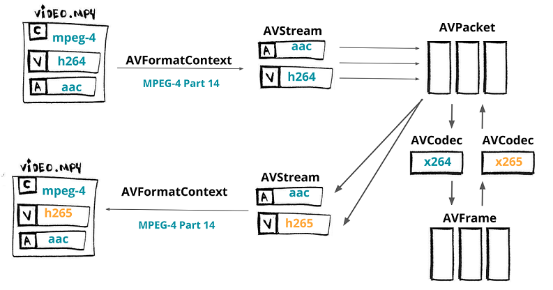

# FFmpeg 转码

- [FFmpeg 转码](#ffmpeg-转码)
  - [转封装](#转封装)
  - [转码](#转码)

本章主要实现一个编码器，编码器主要用到 FFmpeg/libav 中的 [libavcodec](https://ffmpeg.org/libavcodec.html)，libavformat 和 libavutil 将视频从 H264 转到 H265。



> 快速回顾一下：[**AVFormatContext**](https://www.ffmpeg.org/doxygen/trunk/structAVFormatContext.html) 是媒体文件格式的抽象（例如：MKV，MP4，Webm，TS）。 [**AVStream**](https://www.ffmpeg.org/doxygen/trunk/structAVStream.html) 代表给定格式的数据类型（例如：音频，视频，字幕，元数据）。 [**AVPacket**](https://www.ffmpeg.org/doxygen/trunk/structAVPacket.html) 是从 `AVStream` 获得的压缩数据的切片，可由 [**AVCodec**](https://www.ffmpeg.org/doxygen/trunk/structAVCodec.html)（例如 av1，h264，vp9，hevc）解码，从而生成称为 [**AVFrame**](https://www.ffmpeg.org/doxygen/trunk/structAVFrame.html) 的原始数据。

## 转封装

1. 第一步我们需要**加载输入文件**。

   ```cpp
   // 为 AVFormatContext 分配内存
   avfc = avformat_alloc_context();
   // 打开一个输入流并读取头信息
   avformat_open_input(avfc, in_filename, NULL, NULL);
   // 获取流信息
   avformat_find_stream_info(avfc, NULL);
   ```

2. 设置解码的操作，我们用 `AVFormatContext` 可以获取到所有的 `AVStream`，以此获得相应的 `AVCodec`，并且创建特定的 `AVCodecContext`，最终我们将打开给定的编码器来做解码的操作。

   > [**AVCodecContext**](https://www.ffmpeg.org/doxygen/trunk/structAVCodecContext.html) 保存有关媒体的数据包括 码率，帧率，采样率，通道，高还有其他。

   ```cpp
   for (int i = 0; i < avfc->nb_streams; i++)
   {
       AVStream *avs = avfc->streams[i];
       AVCodec *avc = avcodec_find_decoder(avs->codecpar->codec_id);
       AVCodecContext *avcc = avcodec_alloc_context3(*avc);
       avcodec_parameters_to_context(*avcc, avs->codecpar);
       avcodec_open2(*avcc, *avc, NULL);
   }
   ```

3. 准备输出文件，首先为 `AVFormatContext` 来**分配内存**。并为**每一个流**创建输出格式。为了正确打包流，我们还要从解码器**复制编解码参数**。通过设置 `AV_CODEC_FLAG_GLOBAL_HEADER` 来告诉编码器可以使用这个全局头信息，最终我们保持这些头信息写入到输出文件中。

   ```cpp
   avformat_alloc_output_context2(&encoder_avfc, NULL, NULL, out_filename);

   AVStream *avs = avformat_new_stream(encoder_avfc, NULL);
   avcodec_parameters_copy(avs->codecpar, decoder_avs->codecpar);

   if (encoder_avfc->oformat->flags & AVFMT_GLOBALHEADER)
   encoder_avfc->flags |= AV_CODEC_FLAG_GLOBAL_HEADER;

   avio_open(&encoder_avfc->pb, encoder->filename, AVIO_FLAG_WRITE);
   avformat_write_header(encoder->avfc, &muxer_opts);
   ```

4. 我们从解码器获得 `AVPacket`，调整时间戳后写到输出文件。尽管 `av_interleaved_write_frame` 从函数名上来看是 “写入帧信息”，但我们实际存储的是数据包。我们通过写入流的尾部到文件来结束转封装操作。

   ```cpp
   AVFrame *input_frame = av_frame_alloc();
   AVPacket *input_packet = av_packet_alloc();

   while (av_read_frame(decoder_avfc, input_packet) >= 0)
   {
   av_packet_rescale_ts(input_packet, decoder_video_avs->time_base, encoder_video_avs->time_base);
   av_interleaved_write_frame(*avfc, input_packet) < 0));
   }

   av_write_trailer(encoder_avfc);
   ```

## 转码

现在我们将对文件做转码，我们会把视频从 `h264` 转到 `h265`。

在我们解码之后和输出之前，我们将要开始设置我们的编码器。

- 使用 [avformat_new_stream](https://www.ffmpeg.org/doxygen/trunk/group__lavf__core.html) 来创建编码的 `AVStream`。
- 我们使用 `libx265` 做为 `AVCodec`，[avcodec_find_encoder_by_name](https://www.ffmpeg.org/doxygen/trunk/group__lavc__encoding.html)。
- 创建 `AVCodecContext` 作为编码器的基础，[avcodec_alloc_context3](https://www.ffmpeg.org/doxygen/trunk/group__lavc__core.html)。
- 为编解码设置基础属性，并且打开编码器，将参数从上下文复制到流中，使用 [avcodec_open2](https://www.ffmpeg.org/doxygen/trunk/group__lavc__core.html) 和 [avcodec_parameters_from_context](https://www.ffmpeg.org/doxygen/trunk/group__lavc__core.html)。

```cpp
AVRational input_framerate = av_guess_frame_rate(decoder_avfc, decoder_video_avs, NULL);
AVStream *video_avs = avformat_new_stream(encoder_avfc, NULL);

char *codec_name = "libx265";
char *codec_priv_key = "x265-params";
// 我们将对 x265 使用内部的参数
// 禁用场景切换并且把 GOP 调整为 60 帧
char *codec_priv_value = "keyint=60:min-keyint=60:scenecut=0";

AVCodec *video_avc = avcodec_find_encoder_by_name(codec_name);
AVCodecContext *video_avcc = avcodec_alloc_context3(video_avc);
// 编码参数
av_opt_set(sc->video_avcc->priv_data, codec_priv_key, codec_priv_value, 0);
video_avcc->height = decoder_ctx->height;
video_avcc->width = decoder_ctx->width;
video_avcc->pix_fmt = video_avc->pix_fmts[0];
// 控制码率
video_avcc->bit_rate = 2 * 1000 * 1000;
video_avcc->rc_buffer_size = 4 * 1000 * 1000;
video_avcc->rc_max_rate = 2 * 1000 * 1000;
video_avcc->rc_min_rate = 2.5 * 1000 * 1000;
// 时间基数
video_avcc->time_base = av_inv_q(input_framerate);
video_avs->time_base = sc->video_avcc->time_base;

avcodec_open2(sc->video_avcc, sc->video_avc, NULL);
avcodec_parameters_from_context(sc->video_avs->codecpar, sc->video_avcc);
```

为了视频编码，我们需要展开解码的步骤：

- 发送空的 `AVPacket` 给解码器，[avcodec_send_packet](https://www.ffmpeg.org/doxygen/trunk/group__lavc__decoding.html)。
- 接收解压完的 `AVFrame`，[avcodec_receive_frame](https://www.ffmpeg.org/doxygen/trunk/group__lavc__decoding.html)。
- 开始编码元数据。
- 发送元数据， [avcodec_send_frame](https://www.ffmpeg.org/doxygen/trunk/group__lavc__decoding.html)。
- 基于编码器，接受编码数据， `AVPacket`，[avcodec_receive_packet](https://www.ffmpeg.org/doxygen/trunk/group__lavc__decoding.html)。
- 设置时间戳， [av_packet_rescale_ts](https://www.ffmpeg.org/doxygen/trunk/group__lavc__packet.html)。
- 写到输出文件 [av_interleaved_write_frame](https://www.ffmpeg.org/doxygen/trunk/group__lavf__encoding.html)。

```cpp
AVFrame *input_frame = av_frame_alloc();
AVPacket *input_packet = av_packet_alloc();

while (av_read_frame(decoder_avfc, input_packet) >= 0)
{
  int response = avcodec_send_packet(decoder_video_avcc, input_packet);
  while (response >= 0) {
    response = avcodec_receive_frame(decoder_video_avcc, input_frame);
    if (response == AVERROR(EAGAIN) || response == AVERROR_EOF) {
      break;
    } else if (response < 0) {
      return response;
    }
    if (response >= 0) {
      encode(encoder_avfc, decoder_video_avs, encoder_video_avs, decoder_video_avcc, input_packet->stream_index);
    }
    av_frame_unref(input_frame);
  }
  av_packet_unref(input_packet);
}
av_write_trailer(encoder_avfc);

// 使用函数
int encode(AVFormatContext *avfc, AVStream *dec_video_avs, AVStream *enc_video_avs, AVCodecContext video_avcc int index) {
  AVPacket *output_packet = av_packet_alloc();
  int response = avcodec_send_frame(video_avcc, input_frame);

  while (response >= 0) {
    response = avcodec_receive_packet(video_avcc, output_packet);
    if (response == AVERROR(EAGAIN) || response == AVERROR_EOF) {
      break;
    } else if (response < 0) {
      return -1;
    }

    output_packet->stream_index = index;
    output_packet->duration = enc_video_avs->time_base.den / enc_video_avs->time_base.num / dec_video_avs->avg_frame_rate.num * dec_video_avs->avg_frame_rate.den;

    av_packet_rescale_ts(output_packet, dec_video_avs->time_base, enc_video_avs->time_base);
    response = av_interleaved_write_frame(avfc, output_packet);
  }
  av_packet_unref(output_packet);
  av_packet_free(&output_packet);
  return 0;
}
```

我们转换媒体流从 h264 到 h265，和我们预期的差不多，h265 的文件小于 h264，从[创建的程序](../LibFFmpegUsingExample/02_Transcoding.cpp)能够看出：

```cpp
  /*
   * H264 -> H265
   * Audio -> remuxed (untouched)
   * MP4 - MP4
   */
  StreamingParams sp = {0};
  sp.copy_audio = 1;
  sp.copy_video = 0;
  sp.video_codec = "libx265";
  sp.codec_priv_key = "x265-params";
  sp.codec_priv_value = "keyint=60:min-keyint=60:scenecut=0";

  /*
   * H264 -> H264 (fixed gop)
   * Audio -> remuxed (untouched)
   * MP4 - MP4
   */
  StreamingParams sp = {0};
  sp.copy_audio = 1;
  sp.copy_video = 0;
  sp.video_codec = "libx264";
  sp.codec_priv_key = "x264-params";
  sp.codec_priv_value = "keyint=60:min-keyint=60:scenecut=0:force-cfr=1";

  /*
   * H264 -> H264 (fixed gop)
   * Audio -> remuxed (untouched)
   * MP4 - fragmented MP4
   */
  StreamingParams sp = {0};
  sp.copy_audio = 1;
  sp.copy_video = 0;
  sp.video_codec = "libx264";
  sp.codec_priv_key = "x264-params";
  sp.codec_priv_value = "keyint=60:min-keyint=60:scenecut=0:force-cfr=1";
  sp.muxer_opt_key = "movflags";
  sp.muxer_opt_value = "frag_keyframe+empty_moov+default_base_moof";

  /*
   * H264 -> H264 (fixed gop)
   * Audio -> AAC
   * MP4 - MPEG-TS
   */
  StreamingParams sp = {0};
  sp.copy_audio = 0;
  sp.copy_video = 0;
  sp.video_codec = "libx264";
  sp.codec_priv_key = "x264-params";
  sp.codec_priv_value = "keyint=60:min-keyint=60:scenecut=0:force-cfr=1";
  sp.audio_codec = "aac";
  sp.output_extension = ".ts";

  /* WIP :P  -> it's not playing on VLC, the final bit rate is huge
   * H264 -> VP9
   * Audio -> Vorbis
   * MP4 - WebM
   */
  //StreamingParams sp = {0};
  //sp.copy_audio = 0;
  //sp.copy_video = 0;
  //sp.video_codec = "libvpx-vp9";
  //sp.audio_codec = "libvorbis";
  //sp.output_extension = ".webm";
```

> 现在，说实话，[这比我想象中的难](https://github.com/leandromoreira/ffmpeg-libav-tutorial/pull/54)，我必须深入理解 [FFmpeg 命令行源码](https://github.com/leandromoreira/ffmpeg-libav-tutorial/pull/54%23issuecomment-570746749)，并且做很多测试，我想我肯定搞错了一些细节，因为我为 h264 强制 `force-cfr` 才能工作，并且仍然能看见一些`warning 信息（强制帧类型（5）为真类型（3））`。
