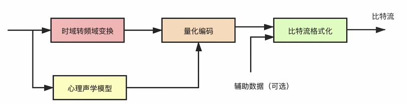

# 音频编码

- [音频编码](#音频编码)
  - [音频压缩](#音频压缩)
    - [信号遮蔽](#信号遮蔽)
    - [无损编码](#无损编码)
  - [音频编码过程](#音频编码过程)

## 音频压缩

1. 消除冗余信息（有损压缩）：消除次声波与超声波、以及被**遮蔽掉的音频信号**。
2. 无损压缩：针对人可以听到的声音数据进行无损压缩。

### 信号遮蔽

信号遮蔽：现实中的声音为复合声音，例如对话中听到对方说话往往伴随着背景音，但是这些声音被对方的说话声遮蔽掉了，这就叫信号遮蔽。可以分为两种：

1. 频域遮蔽；
    - 图中静音门槛：低于这条曲线的均屏蔽忽略。
    - 图中遮蔽源生成一条遮蔽曲线，将低于这个范围的均屏蔽。

    

2. 时域遮蔽。
    - 接近主声音前后的前遮蔽与后遮蔽。

    

### 无损编码

1. 熵编码：
   - 哈夫曼编码；
   - 算术编码；
   - 香农编码。

## 音频编码过程

