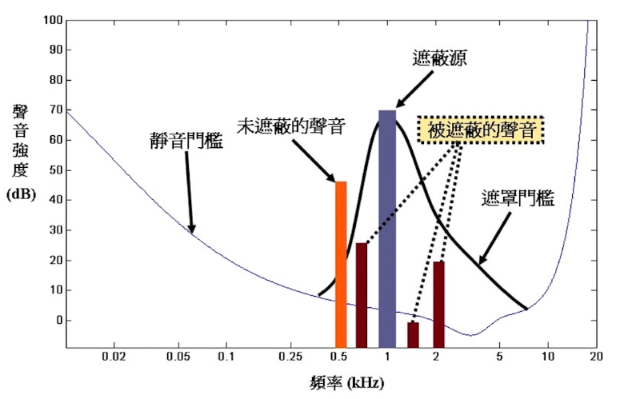
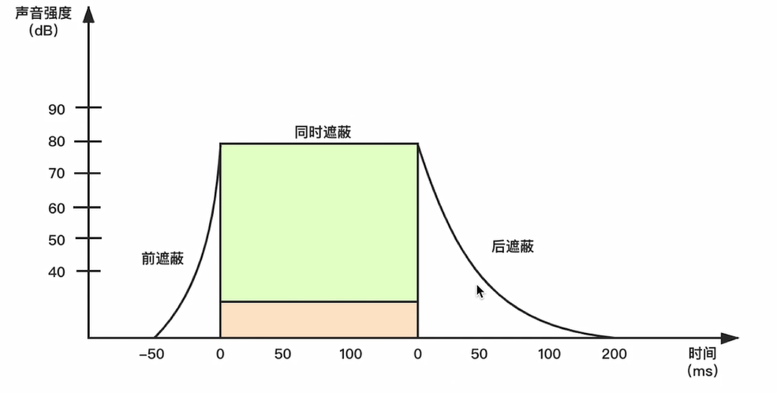
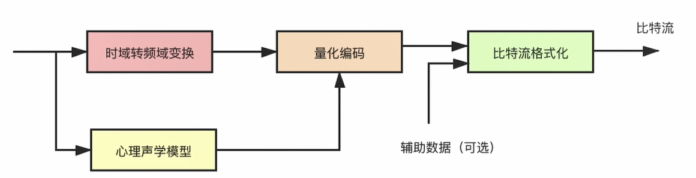
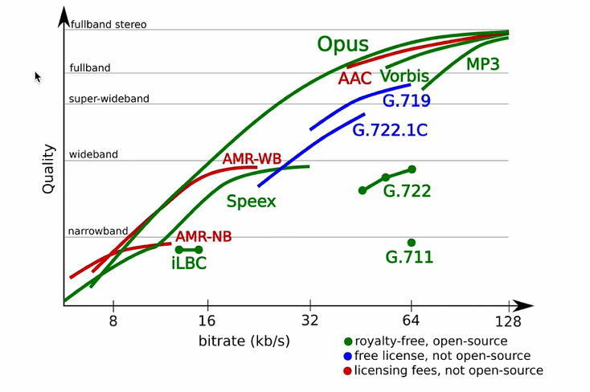
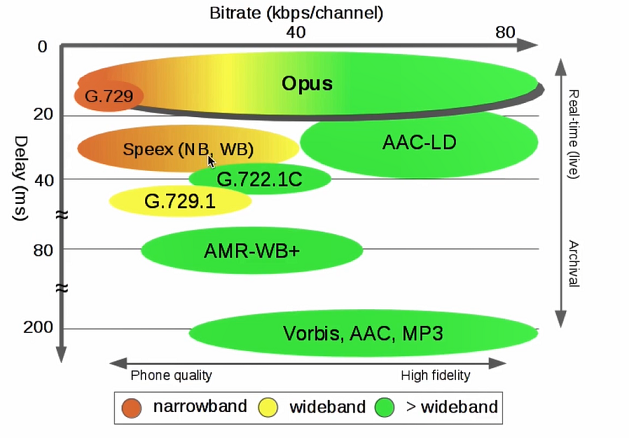
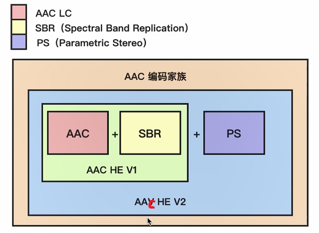
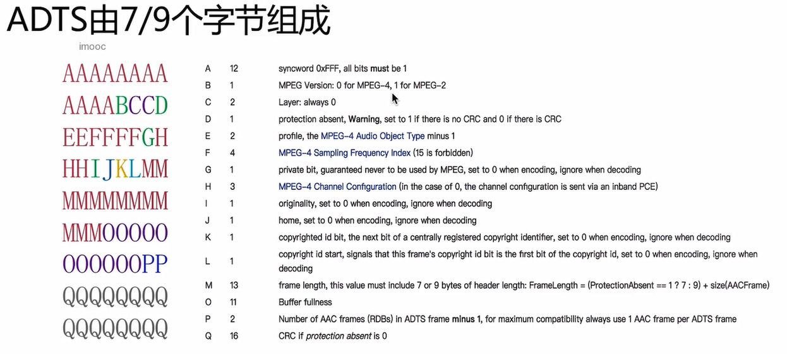

# 音频编码

- [音频编码](#音频编码)
  - [音频编码基础](#音频编码基础)
    - [信号遮蔽](#信号遮蔽)
    - [无损编码](#无损编码)
    - [音频编码过程](#音频编码过程)
    - [常见的音频编解码器](#常见的音频编解码器)
  - [AAC 编码器介绍](#aac-编码器介绍)
  - [通过 FFmpeg 生成 AAC 文件](#通过-ffmpeg-生成-aac-文件)

## 音频编码基础

1. 消除冗余信息（有损压缩）：消除次声波与超声波、以及被**遮蔽掉的音频信号**。
2. 无损压缩：针对人可以听到的声音数据进行无损压缩。

### 信号遮蔽

信号遮蔽：现实中的声音为复合声音，例如对话中听到对方说话往往伴随着背景音，但是这些声音被对方的说话声遮蔽掉了，这就叫信号遮蔽。可以分为两种：

1. 频域遮蔽；
    - 图中静音门槛：低于这条曲线的均屏蔽忽略。
    - 图中遮蔽源生成一条遮蔽曲线，将低于这个范围的均屏蔽。

    

2. 时域遮蔽。
    - 接近主声音前后的前遮蔽与后遮蔽。

    

### 无损编码

1. 熵编码：
   - 哈夫曼编码；
   - 算术编码；
   - 香农编码。

### 音频编码过程

### 常见的音频编解码器

常见的编解码格式 OPUS、AAC、Ogg、Speex、iLBC、AMR、G.711 等。

AAC 在直播系统中应用比较广泛。

OPUS 是较新的音频编码器，WebRtc 默认使用 OPUS。

固话一般使用 G.711 系列，窄带音频。

各音频编码格式质量比较：

各音频编码格式实时性：

## AAC 编码器介绍

AAC 最开始基于 MPEG-2 的音频编码技术，MPEG-4 标准出现后，AAC 重新集成了其特性，加入了 SBR 技术和 PS 技术。

- 目前常用的规格右 AAC LC、AAC HE V1、AAC HE V2。
  - AAC LC（Low Complexity）：低复杂度规格，码流是 128k，音质好。
  - AAC HE：等于 AAC LC + SBR（Spectral Band Replication），核心思想是按音谱保存。低频编码保存主要成分，高频单独放大编码保存音质。码流在 64K 左右。
  - AAC HE V2：等于 AAC LC + SBR + PS（Parametric Stereo）。核心思想是双声道中的声音存在某种相似性，只需寻出一个声道的全部信息，然后花很少的字节用参数描述另一个声道与它不同的地方。

规格关系如下图：

- AAC 格式：
  - ADIF（Audio Data Interchange Format）：这种格式的特征是可以确定的找到这个音频数据的开始，只能从头开始解码，不能在音频数据流中间开始。这种格式常用在磁盘文件中。
  - ADTS（Audio Data Transport Stream）：这种格式的特征是每一帧都有一个同步字，所以可以在音频流的任何位置开始解码。它类似于数据流格式。

- ADTS 结构：

    

## 通过 FFmpeg 生成 AAC 文件

- ffmpeg -i xxx.mp4 -vn -c:a libfdk_aac -ar 44100 -channels 2 -profile:a aac_he_v2 3.aac
  - `-i xxx.mp4`： 输入源文件。
  - `-vn`：video no 过滤掉视频。
  - `-c:a libfdk_aac`：-c 编码器 :a audio 为指定音频的编码器为 libfdk_aac。
  - `-ar`：采样率。
  - `-channels`：通道数。
  - `-profile:a aac_he_v2`：对音频设置参数为 aac_he_v2。
