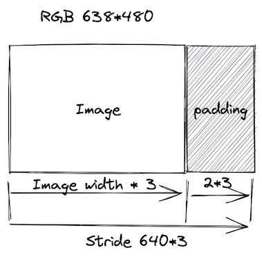

# 视频基础知识

- [视频基础知识](#视频基础知识)
  - [视频](#视频)
    - [码流计算](#码流计算)
    - [图像的显示](#图像的显示)
  - [YUV](#yuv)
    - [YUV 的存储格式](#yuv-的存储格式)

## 视频

1. 由一组图像组成：图像由像素组合而成，每个像素由 RGB 控制，整张图由多少像素点描述这就是分辨率。
   - 位深：用多少位标识一个像素。例如 RGB888(24 位）、RGBA(32 位）。
   - BGR：BMP 使用 BGR 格式，需要进行转换为 RGB 进行展示。
2. 为了传输/占用更小的空间而被压缩。
3. 最终在显示设备上展示（未压缩）。
   - PPI（pixels per inch）：一寸长的距离内放了多少像素点。PPI > 300 书与视网膜级别。
   - DPI（Dots pen inch）：每英寸的像素点数。

### 码流计算

1. 分辨率：

   - X 轴像素个数 \* Y 轴像素个数；
   - 常见宽高比 16:9、4:3，其他非标准宽高比需要转换。
   - 360P/720P/1K/2K。

2. 帧率：

   - 每秒钟采集、播放图像的个数；
   - 动画的帧率 25 帧/s；
   - 常见的帧率 15 帧/s，30 帧/s，60 帧/s。

3. 码率：视频文件在单位时间内使用的数据流量，例如 1Mbps。

   - 未编码视频的 RGB 码流的大小：
     - RGB 码流 = 分辨率（宽\*高）x 3（Byte）x 帧率（25 帧）

4. Stride 跨距：内存中每行像素所占用的空间。为了内存对齐每行像素在内存中所占用的空间并不一定是图像的宽度。
   - Stride 就是这些扩展内容的名称，Stride 也被称作 Pitch，如果图像的每一行像素末尾拥有扩展内容，Stride 的值一定大于图像的宽度值。
   - 
     > 比如分辨率 638x480 的 RGB24 图像，我们在内存处理的时候如果要以 16 字节对齐， 则 638*3/16=119.625 不能整除，因此不能 16 字节对齐，我们需要在每行尾部填充 6 个字节。就是 (638+2->640), 640*3/16=120。此时该图片的 stride 为 1920 字节。

### 图像的显示

1. 图像大小等于显示区域的大小，正常显示；
   - 因为往往图像大小与屏幕大小并不相等，往往与显示区域相比。
2. 图像小于显示区域，需要进行拉伸、留白；
3. 图像大于显示区域，需要进行缩小、截断。

## YUV

1. YUV（也称 YCbCr）：Y 标识明亮度，UV 的作用时描述影像色彩及饱和度。

   - 主要采样格式有 YUV 4:2:0、YUV 4:2:2、YUV 4:4:4
   - [学习文档](https://zhuanlan.zhihu.com/p/75735751)

2. RGB 与 YUV 的关系：

   - RGB 用于屏幕图像的展示。
   - YUV 用于采集与编码。

3. [YUV 格式 4:2:0 标准格式](https://github.com/leandromoreira/digital_video_introduction/blob/master/README-cn.md#%E8%89%B2%E5%BA%A6%E5%AD%90%E9%87%87%E6%A0%B7)：4:2:0 并不意味着没有 Cr 分量，它实际指得对每行扫描线来说，只有一种色度分量，以 2:1 得抽样率存储。相邻得扫描行存储不同的色度分量，例如一行是 4:2:0 下一行就是 4:0:2 再下一行就是 4:2:0。

### YUV 的存储格式

- [参考文章](https://www.cnblogs.com/daner1257/p/10767570.html)

- YUV 是一个比较笼统地说法，针对它的具体排列方式，可以分为很多种具体的格式：
  - 打包 (packed) 模式：将每个像素点的 Y、U、V 分量交叉排列并以像素点为单元连续的存放在同一数组中，通常几个相邻的像素组成一个宏像素 (macro-pixel)。
  - 平面 (planar) 格式：使用三个数组分开连续的存放 Y、U、V 三个分量，即 Y、U、V 分别存
    放在各自的数组中。
