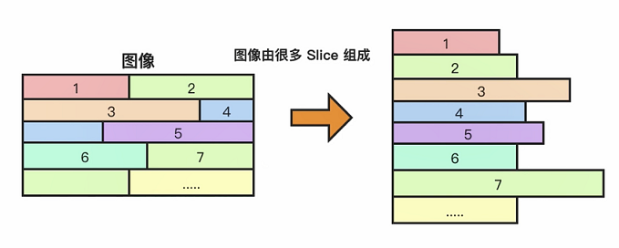

# H264 基础

- [H264 基础](#h264-基础)
  - [H264 信息](#h264-信息)
  - [H264 压缩技术](#h264-压缩技术)
  - [帧内压缩技术](#帧内压缩技术)
  - [帧间压缩原理](#帧间压缩原理)
  - [无损压缩](#无损压缩)
  - [H264 编解码流程图](#h264-编解码流程图)
  - [H264 码流分层](#h264-码流分层)

## H264 信息

1. 压缩比，假设条件如下：
   - YUV 格式为 YUV420；
   - 分辨率 640 * 480；
   - 帧率为 15。
   - 码流值为：`640 * 480 * 1.5（YUV420）* 15（byte） * 8 = 55 Mbps`。
   - 这个格式的 H264 [建议码流](https://docs.agora.io/cn)为 500kpbs，压缩比约为 1/100。

2. I 帧、P 帧、B 帧与 GOP：[详见这里](../00_FFmpeg概览/04_FFmpeg之音视频同步.md#i-帧p-帧b-帧gop)

## H264 压缩技术

[参考文章](https://zhuanlan.zhihu.com/p/31056455)

## 帧内压缩技术

主要为了解决 I 帧（包含 IDR 帧）的压缩问题。

1. 相邻像素差别不大，所以可以通过宏块预测。
2. 人们对于亮度敏感度超过色度。
3. YUV 很容易将亮度与色度分开，亮度块与色度块单独预测。

H264 将某个点开始以宏块为单位进行预测。将这个位置数据变为宏块的处理模式编号。一共由以下九种模式：

可以预测成如下，分别是数列预测，水平预测，平均预测：

通过预测压缩技术，可以减少帧的大小，但是预测出来的数据往往还是与原始由差别：

当生成预测数据后，需要在与原始图做差值得到残差。

最终将残差值与预测模式信息进行压缩。

接收端就可以先通过预测模式信息预测出图像，再加上残差值即可得到非常接近原始图像的数据。

## 帧间压缩原理

P 帧、B 帧使用帧间压缩技术。

1. GOP：一组强相关的帧。
2. 参考帧：P B 均需要参考帧。而本身只存储与参考帧有差异的信息即可。
3. 运动估计（宏块匹配 + 运动矢量）：
   - 宏块查找：将一张图划分为很多个小方块，同一个 GOP 中会有很多相似的帧，抽出相邻的两个帧，假设比对第一张所有宏块在第二张帧的位置，找出第一张 A 点的宏块出现在第二章 B 点位置的情况，则可以判断这个移动的物体运动的方向与距离，这就是运动矢量。
   - 宏块查找算法：三部搜索、三维对数搜索、四步搜索、钻石搜索。
   - 通过宏块的查找就是运动估计：如下图，查找虽有帧的运动矢量就会得到下图右测的数据，标识了宏块运动的方位矢量图。这样只需要存储这个矢量即可。

    

4. 运动补偿：仅通过运动估计进行解码后，可能与原始图像还是有较大差异，这一部分就需要残差值来进行运动补偿。

- 花屏：如果 GOP 分组中有帧丢失，会造成解码端的图像发生错误，这就出现了马赛克（花屏）。
- 视频卡的：避免花屏的问题，需要有帧丢失时，就丢弃 GOP 内的所有帧，直到下一个 IDR 帧重新刷新图像。I 帧是按照周期来的，在下一个周期 I 帧来视频就是静止不动了，这就是所谓的卡顿。

## 无损压缩

1. DCT 变换：经过有损压缩后数据往往是比较分散的，这就需要通过 DCT 变换将数据集中到一个位置上。

     

2. VLC 压缩：通过 DCT 变换后就可以进行无损压缩了。VLC 是可变长的编码。将信息出现频率高的使用短码替代，频率低的使用长码替代达到压缩的目的。

    

3. CABAC 压缩（上下文适配的二进制算数编码）：CABAC 是根据上下文，也就是随着数据的增加后续编码出的数据会越来越小。

    

## H264 编解码流程图

## H264 码流分层

1. NAL 层（NetWork Abstraction Layer）：视频数据网络抽象层，方便网络传输，如果直接传输二进制数据当出现乱序丢包无法进行纠错，这就是 H264 增加 NAL 层进行纠错。
2. VLC 层（Video Coding Layer）：视频数据编码层，前面讲得帧间编码、帧内编码数据。VLC 结构关系如下：

    

3. 码流得基本概念：
   - SODB（String Of Data Bits）：二进制数据串。原始数据比特流，由 VCL 层产生数据**按位排列**，长度不一定是 8 的倍数，故需要补齐。
   - RBSP（Raw Byte Sequence Payload）：**按字节存储得原始数据**。SODB + trailing bits，算法是如果 SODB 最后一个字节不对其，则补 1 或 多个 0。
   - NALU：NALU 单元。NAL Header(NAL 1B) + RBSP（VLC）。多个 NAL 单元就组成了 H264 码流。

    

   - slice 可以切割多个，一般情况只有一个：

    

   - 每个宏块 MacroBlock 包含了宏块的类型、预测值、残差值。

    

- 码流分层，H264 由两种格式：每个 NAL Unit 前会有一个 Start Code 这么个起始码，这就是 Annexb 格式用于本地存放，这个其实码用于区分 NAL 单元间分隔符，便于播放器解码。不包含 StartCode 就是 RTP 网络传输格式。

