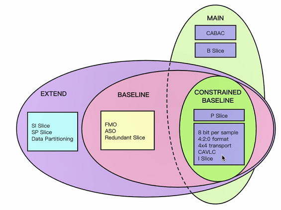
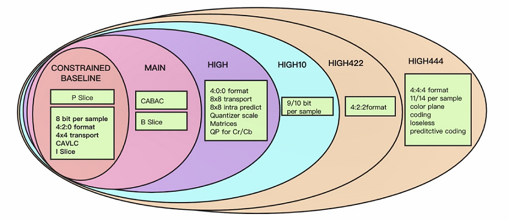
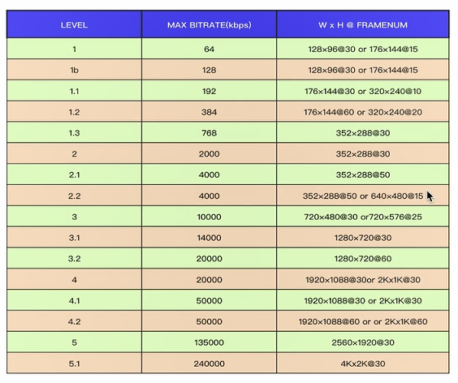
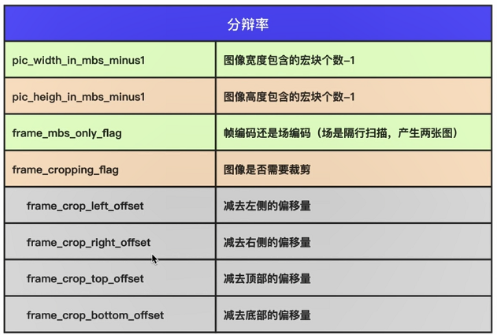
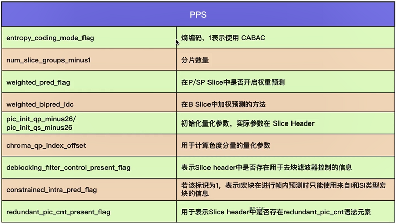

# FFmpeg 编解码

- [FFmpeg 编解码](#ffmpeg-编解码)
  - [SPS/PPS/Slice Header](#spsppsslice-header)
    - [SPS](#sps)
    - [PPS](#pps)
    - [Slice Header](#slice-header)
    - [常见的分析工具](#常见的分析工具)
  - [实验——打开视频编码器](#实验打开视频编码器)
  - [x264 参数](#x264-参数)

[参考代码](../../LibFFmpegUsingExample/Src/01_FFmpegUsingExample/04_FFmpegReadNV12ToYum420BaseMac.c)

## SPS/PPS/Slice Header

### SPS

在 H.264 标准协议中规定了多种不同的 NAL Unit 类型，其中类型 7 表示该 NAL Unit 内保存的数据为 Sequence Paramater Set。即 SPS 又称作序列参数集。SPS 中保存了一组编码视频序列 (Coded video sequence) 的全局参数。其中主要的参数如下：

1. H264 Profile：对视频压缩特性的描述，Profile 越高，就说明采用了越高级的压缩特性。
    - Profile 有两个分支，都是基于 CONSTRAINED BASELINE 发展而来。我们用的更多的是 MAIN。

        

    - MAIN Profile 之上还有很多等级，详见下图：
  
        

2. H264 Level：Level 是对视频的描述，Level 越高，视频的码流、分辨率、fps 越高，是对整个视频的规格描述。

    

3. SPS 分辨率参数：下图中是与分辨率有关的属性。

    

4. 帧相关参数：
    - 帧数：log2_max_frame_num_minus4 在一个 GOP 中解码的最大帧数。
    - 参考帧数：max_num_ref_frames 最大参考帧数。
    - 显示帧序号：pic_order_cnt_type 不同的 type 不同的计算数值方法。

5. 帧率相关：
   - framerate = (float)(sps->vui.vui_time_scale) / (float)(sps->vui.vui_num_units_in_tick) / 2;

### PPS

除了序列参数集 SPS 之外，H.264 中另一重要的参数集合为图像参数集 Picture Paramater Set（PPS）。通常情况下，PPS 类似于 SPS，在 H.264 的裸码流中单独保存在一个NAL Unit 中，只是 PPS NAL Unit 的 nal_unit_type 值为 8；而在封装格式中，PPS 通常与 SPS 一起，保存在视频文件的文件头中。

- PPS 比较重要的参数，见下图：

    

### Slice Header

1. 帧类型；
2. GOP 中解码帧序号；
3. 预测权重；
4. 滤波。

### 常见的分析工具

1. Elecard Stream Eye。
2. CodecVisa。
3. 雷神开发的工具，基于 FFmpeg 实现。SpecialVH264、VideoEye，Windows。

## 实验——打开视频编码器

1. 打开编码器，设置一些参数，目标编码器、GOP、码流大小、宽和高。

    ```cpp
    //分辨率的宽高与 video_size 一致
    static void open_encoder(int width, int height, AVCodecContext** enc_ctx)
    {
        AVCodec* codec = NULL;
        codec = avcodec_find_encoder_by_name("libx264");
        if (!codec)
        {
            printf("Codec libx264 not found\n");
            exit(1);
        }

        *enc_ctx = avcodec_alloc_context3(codec);

        if (!*enc_ctx)
        {
            printf("Could not allocate vide codec context!\n");
            exit(1);
        }

        // SPS/PPS
        (*enc_ctx)->profile = FF_PROFILE_H264_HIGH_444;
        (*enc_ctx)->level = 50;   // 标识 Level 为 5.0

        // 设置分辨率
        (*enc_ctx)->width = width;
        (*enc_ctx)->height = height;

        // GOP 设置
        (*enc_ctx)->gop_size = 250;
        (*enc_ctx)->keyint_min = 25;   //可选 最小插入I帧间隔，如果在 GOP 过程中如果图像由突变会自动插入 I 帧

        // 设置 B 帧数量
        (*enc_ctx)->max_b_frames = 3;   //可选
        (*enc_ctx)->has_b_frames = 1;   //可选

        // 设置参考帧数量
        (*enc_ctx)->refs = 3;   //可选

        //设置输入 YUV 编码格式 libx264 要求输入为 420P
        (*enc_ctx)->pix_fmt = AV_PIX_FMT_YUV420P;

        //设置码率
        (*enc_ctx)->bit_rate = 3150000;   // 3150 Kbps

        //设置帧率
        (*enc_ctx)->time_base = (AVRational) { 1, 25 };   // 帧与帧之间的间隔是 timebase
        (*enc_ctx)->framerate = (AVRational) { 25, 1 };   // 帧率，每秒 25 帧与 timebase 成倒数关系

        int ret = avcodec_open2((*enc_ctx), codec, NULL);
        if (ret != 0)
        {
            char errors[1024] = {
                0,
            };
            av_strerror(ret, errors, 1024);
            fprintf(stderr, "Failed to open audio device, [%d]%s\n", ret, errors);
            exit(1);
        }
    }
    ```

2. 准备编码数据 AVFrame，注意 AVFrame 设置的参数。

    ```cpp
    static AVFrame* create_frame(int width, int height)
    {
        AVFrame* frame = NULL;
        frame = av_frame_alloc();
        char errors[1024] = {
            0,
        };
        int ret = 0;
        if (!frame)
        {
            printf("Error, No Memory!\n");
            goto __ERROR;
        }
        frame->width = width;
        frame->height = height;
        frame->format = AV_PIX_FMT_YUV420P;

        // alloc inner memory
        ret = av_frame_get_buffer(frame, 32);   // 按 32 位对齐
        if (ret < 0)
        {
            av_strerror(ret, errors, 1024);
            fprintf(stderr, "Failed to open audio device, [%d]%s\n", ret, errors);
            goto __ERROR;
        }
        return frame;
    __ERROR:
        if (frame)
        {
            av_frame_free(&frame);
        }
        return NULL;
    }
    ///////////////////////////
    //创建 AVFrame
    frame = create_frame(WIDTH, HEIGHT);
    if (!frame)
    {
        printf("ERROR, Failed to create frame!\n");
        goto __ERROR;
    }

    newpkt = av_packet_alloc();
    if (!newpkt)
    {
        printf("ERROR, Failed to alloc packet!\n");
        goto __ERROR;
    }
    ```

3. 转换 NV12 到 YUV420P。

    ```cpp
    // write file
    //（宽 x 高）x (位深 yuv422 = 2/ yuv420 = 1.5/ yuv444 = 3)

    // YYYYYYYYUVUV   NV12
    // YYYYYYYYUUVV  YUV420
    // 转换  先将 NV12 的 Y 数据拷贝到 data[0] 中
    // 1920 x 1080 = 2073600 Y 数据长度
    memcpy(frame->data[0], pkt.data, 2073600);   // copy Y data

    // UV
    // 2073600 / 4 为 UV 分辨率
    // 2073600之后是 UV 数据
    for (int i = 0; i < 2073600 / 4; i++)
    {
        frame->data[1][i] = pkt.data[2073600 + i * 2];
        frame->data[2][i] = pkt.data[2073600 + i * 2 + 1];
    }
    fwrite(frame->data[0], 1, 2073600, outfile);
    fwrite(frame->data[1], 1, 2073600 / 4, outfile);
    fwrite(frame->data[2], 1, 2073600 / 4, outfile);
    ```

4. H264 编码，注意 pts应当赋值且连续，当读取完成后还要传一个 NULL frame 给编码器，刷新缓冲取。

    ```cpp
    while (read frame){
        ////.............
        frame->pts = base++;
        encode(enc_ctx, frame, newpkt, h264outfile);
        // release pkt
        av_packet_unref(&pkt);
    }
    encode(enc_ctx, NULL, newpkt, h264outfile);   // 给编码器传入 NULL ,使得编码器情况缓冲区


    static void encode(AVCodecContext* enc_ctx, AVFrame* frame, AVPacket* newpkt, FILE* outfile)
    {
        int ret = 0;
        if (frame)
            printf("send frame to encoder, pts = %lld\n", frame->pts);

        // 送原始数据进入编码器
        ret = avcodec_send_frame(enc_ctx, frame);
        if (ret < 0)
        {
            printf("Error, send a frame for encoding failed\n");
            exit(1);
        }

        // 从编码器获取编码好的数据
        while (ret >= 0)
        {
            ret = avcodec_receive_packet(enc_ctx, newpkt);
            //如果编码器数据不足时会返回 EAGAIN，或者数据尾时会返回 AVERROR_EOF
            if (ret == AVERROR(EAGAIN) || ret == AVERROR_EOF)
            {
                return;
            }
            if (ret < 0)
            {
                printf("Error, failed to encode\n");
                exit(1);
            }
            if (ret != 0)
            {
                char errors[1024] = {
                    0,
                };
                av_strerror(ret, errors, 1024);
                fprintf(stderr, "Failed to open audio device, [%d]%s\n", ret, errors);
            }
            fwrite(newpkt->data, 1, newpkt->size, outfile);
            av_packet_unref(newpkt);   // 注意释放资源
        }
    }
    ```

## x264 参数

1. 预设值：
   - preset (very)fast / (very)slow...：very fast用于实时通讯追求编码块，清晰度要求低。反之 slow 则是清晰度要求高编码慢。
   - tune：质量模式。
2. 帧相关设置值：
   - keyint/min-keyint：GOP 大小默认 250。min-keyint 自动插图，当 GOP 中图片差异过大时自动插入 I 帧的最小 GOP 区间。
   - scenecut：设置图片差异过大的标准，提供给 min-keyint 自动插入 I 帧。
   - bframes：连续 B 帧数量。
   - ref：参考帧数量。
   - no-deblock/deblock：去块化，解码后经过预测得到的数据加上差值还是会存在像素块通过这个滤波器平滑处理。no 不适用。
   - no-cabac/cabac： cabac 熵编码。
3. 码流的控制：
   - Qp 关注量化器：比 crf 码流大且与 bitrate/crf 互斥。Qp 设置量化器，crf 关注视频质量，bitrate 关注最终码流大小。
   - Bitrate：关注码流，无法控制质量。
   - crf：关注质量，默认是 23，数越低越好。
   - Qmin：默认 10 ，最小的量化器值。
   - QMax：默认 51，最大的量化器值。
   - Qpstep 两帧之间量化器的最大变化，默认 4。
4. 编码分析：
   - partitions：p8x8， b8x8，i8x8，i4x4。各个帧指定宏块划分大小。
   - Me 运动评估算法设置。
5. 输出：
   - SAR：设置输出宽高比。
   - fps：帧率。
   - level：质量 Level。

example:

ffmpeg -vsync 1 -async 1 -i xxx.flv -b:v 200k -maxrate 250k -bufsize 400k -pix_fmt yuv420p -vcodec libx264 -coder 1 -refs 3 -bf 5 -flags +loop -deblock -1:-1 -partitions i4x4+i8x8+p8x8+b8x8 -me_method umh -g 60 -keyint_min 30 -qmin 0 -qmax 69 -qdiff 2 out.mp4

- `-vsync 1 -async 1 -i xxx.flv`     ： 　视频、音频同步  输入 xxx.flv 文件
- `-b:v 200k`                        ：   控制视频码率为 200k
- `-maxrate 250k`                    ：   最大码流为 250k
- `-bufsize 400k`                    ：   码流相关
- `-pix_fmt yuv420p`                 ：   转换的原始数据格式
- `-vcodec libx264`                  ：   264 编码器
- `-coder 1`                         ：   cabac 熵编码
- `-refs 3`                          ：   参考帧 3
- `-bf 5`                            ：   b 帧最大数量 5
- `-flags +loop -deblock -1:-1`      ：   使用去块化滤波
- `-partitions i4x4+i8x8+p8x8+b8x8`  ：   宏块设置
- `-me_method umh`                   ：   运动估算算法
- `-g 60`                            ：   GOP 60
- `-keyint_min 30`                   ：   最小 GOP 为 30
- `-qmin 0 -qmax 69`                 ：   最小量化 0 最大 69
- `-qdiff 2`                         ：   Qpstep 两帧之间差异量化器

[H264 参数列表](http://www.chaneru.com/Roku/HLS/X264_Settings.htm)

[H264 参数与 FFmpeg 参数映射关系](https://sites.google.com/site/linuxencoding/x264-ffmpeg-mapping)
