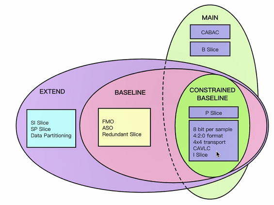
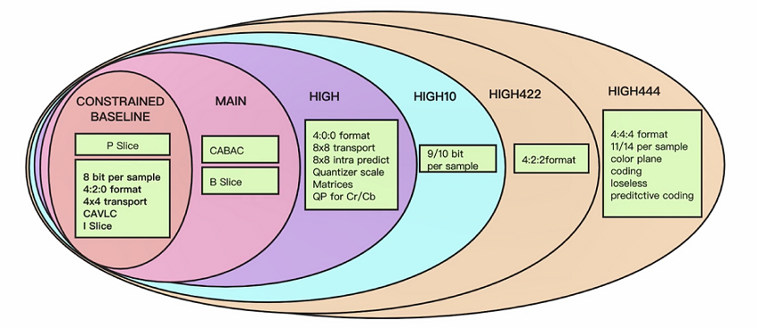
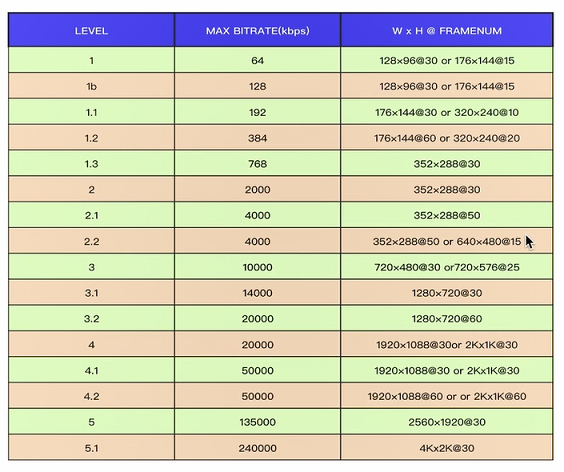
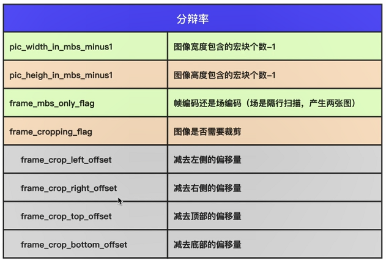
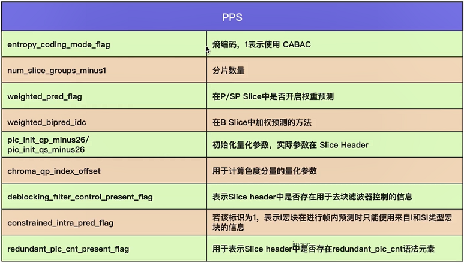

# FFmpeg 编解码

- [FFmpeg 编解码](#ffmpeg-编解码)
  - [SPS/PPS/Slice Header](#spsppsslice-header)
    - [SPS](#sps)
    - [PPS](#pps)
    - [Slice Header](#slice-header)
  - [常见的分析工具](#常见的分析工具)
  - [实验——打开视频编码器](#实验打开视频编码器)

## SPS/PPS/Slice Header

### SPS

在 H.264 标准协议中规定了多种不同的 NAL Unit 类型，其中类型 7 表示该 NAL Unit 内保存的数据为 Sequence Paramater Set。即 SPS 又称作序列参数集。SPS 中保存了一组编码视频序列 (Coded video sequence) 的全局参数。其中主要的参数如下：

1. H264 Profile：对视频压缩特性的描述，Profile 越高，就说明采用了越高级的压缩特性。
    - Profile 有两个分支，都是基于 CONSTRAINED BASELINE 发展而来。我们用的更多的是 MAIN。
        
    - MAIN Profile 之上还有很多等级，详见下图：
        

2. H264 Level：Level 是对视频的描述，Level 越高，视频的码流、分辨率、fps 越高，是对整个视频的规格描述。
    

3. SPS 分辨率参数：下图中是与分辨率有关的属性。

    

4. 帧相关参数：
    - 帧数：log2_max_frame_num_minus4 在一个 GOP 中解码的最大帧数。
    - 参考帧数：max_num_ref_frames 最大参考帧数。
    - 显示帧序号：pic_order_cnt_type 不同的 type 不同的计算数值方法。

5. 帧率相关：
   - framerate = (float)(sps->vui.vui_time_scale) / (float)(sps->vui.vui_num_units_in_tick) / 2;

### PPS

除了序列参数集 SPS 之外，H.264 中另一重要的参数集合为图像参数集 Picture Paramater Set（PPS）。通常情况下，PPS 类似于 SPS，在 H.264 的裸码流中单独保存在一个NAL Unit 中，只是 PPS NAL Unit 的 nal_unit_type 值为 8；而在封装格式中，PPS 通常与 SPS 一起，保存在视频文件的文件头中。

- PPS 比较重要的参数，见下图：

    

### Slice Header

1. 帧类型；
2. GOP 中解码帧序号；
3. 预测权重；
4. 滤波。

## 常见的分析工具

1. Elecard Stream Eye。
2. CodecVisa。
3. 雷神开发的工具，基于 FFmpeg 实现。SpecialVH264、VideoEye，Windows。

## 实验——打开视频编码器
