# RTMP 协议

- [RTMP 协议](#rtmp-协议)
  - [RTMP 链接的建立](#rtmp-链接的建立)
  - [RTMP 消息格式](#rtmp-消息格式)
    - [RTMP 消息类型](#rtmp-消息类型)
  - [FLV 协议信息](#flv-协议信息)
    - [FLV 协议分析器](#flv-协议分析器)

## RTMP 链接的建立

1. RTMP Connection：RTMP 协议是基于 TCP 协议建立的基础上进行。在 TCP 之上再进行 RTMP 链接（握手），然后建立起 RTMP Connection，这个管道传输的是一个流数据。

    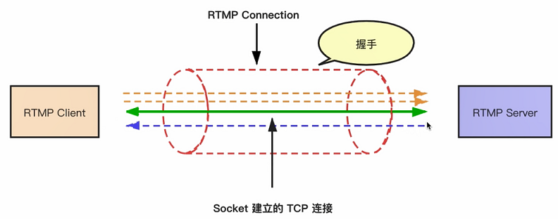

2. RTMP 创建流的基本流程：
   - socket 建立 TCP 链接。
   - RTMP 握手。
   - 建立 RTMP 链接。
   - 创建 RTMP 流。
   - 推流/拉流。

3. RTMP 握手协议：
   - 官方协议文档，有些出入：

    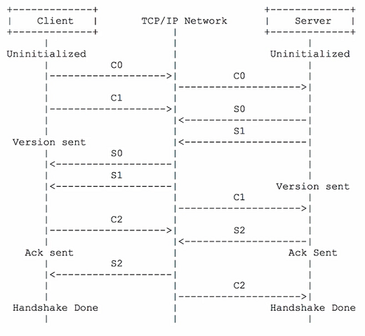

   - 实际抓包，C0、C1 一个包发出，S0+S1+S2 应答，在发送 C2 应答：

    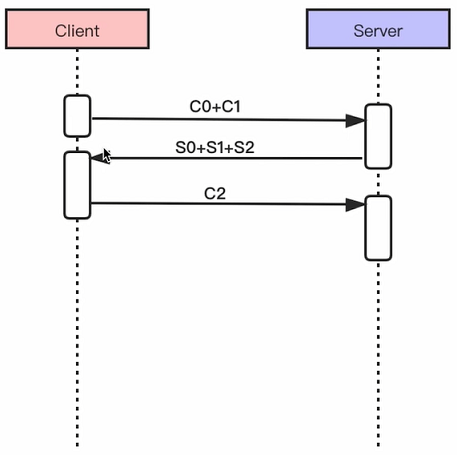

4. 建立 RTMP 链接：
    - 官方协议文档，有些出入：

    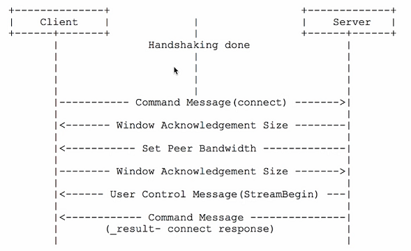

    - 实际抓包：

    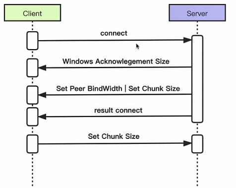

5. 协议中 RTMP 流的创建
    - FCPublishStream 是为了兼容官方 RTMP 服务。

    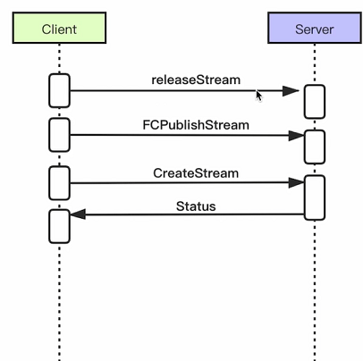

6. 推流：
    -metaData 存放推送流的音视频基本信息，分辨率、帧率、音频采样等等。

    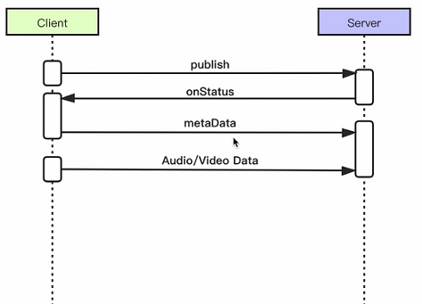

7. 拉流：
    - 拉 RTMP 流：

    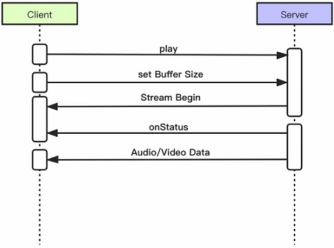

## RTMP 消息格式

- [参考文章--rtmp 协议详解](https://www.cnblogs.com/jimodetiantang/p/8974075.html)

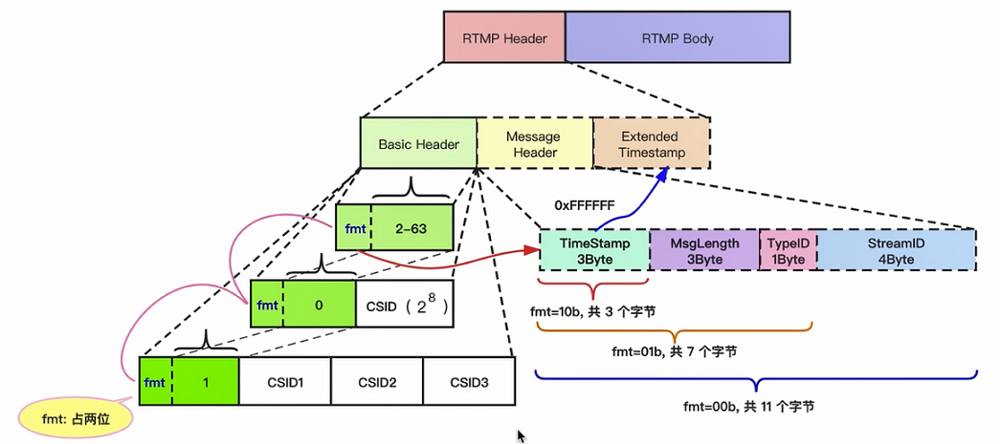

1. 基础由 Header 和 Body 组成。
2. Header 又包括基本头信息（必须）、消息头信息（可选）、扩展时间戳（可选）。
3. Basic Header 是动态变化的，最基本的 Header 由一个字节组成，分为两个部分，fmt 占前两位，后边的 6 位可以表示为数字 2 - 63，0、1 有特殊作用，用来标识 Basic Header 整体是占两个字节还是四个字节。
   - 第二个位为 2-63 标识整个 Basic Header 占一个字节。
   - 第二个位为 0 ，标识整个 Basic Header 占两个字节。
   - 第二个位为 1，标识整个 Basic Header 占四个字节

4. Message Header 也是可变的，根据 fmt 不同标识长度也不一样。
5. 3 字节的 TimeStamp 无法标识时间即 0xFFFFFF，这时就启用了扩展时间戳 Extended Timestamp。

### RTMP 消息类型

- RTMP 消息头中由一个 TypeID 表示不同的消息类型，类型信息见下图：

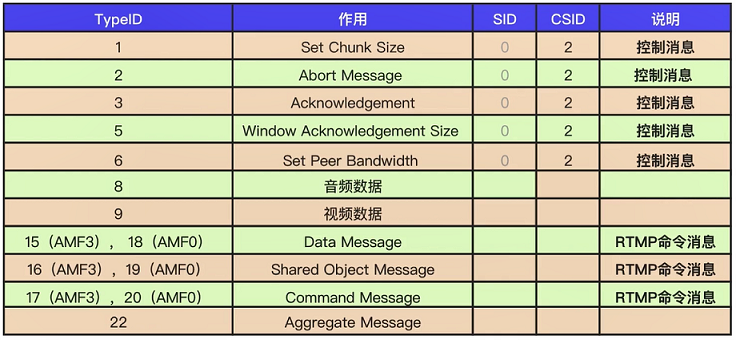

## FLV 协议信息

FLV 与 RTMP 的关系密切，实际上 RTMP 流约等于 flv，区别就是 rtmp 数据加上一个头就是 flv 文件了。推流时，要将其他格式的文件转为 flv 再进行推流到 rtmp。

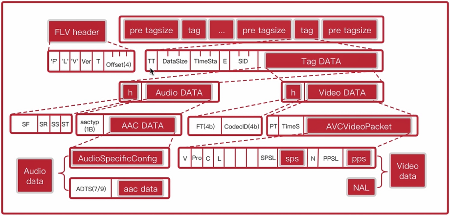

### FLV 协议分析器

Diffindo
