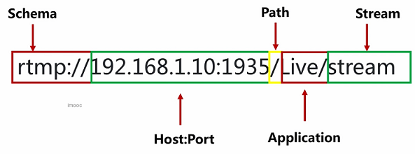
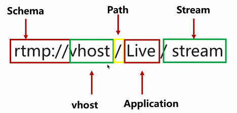
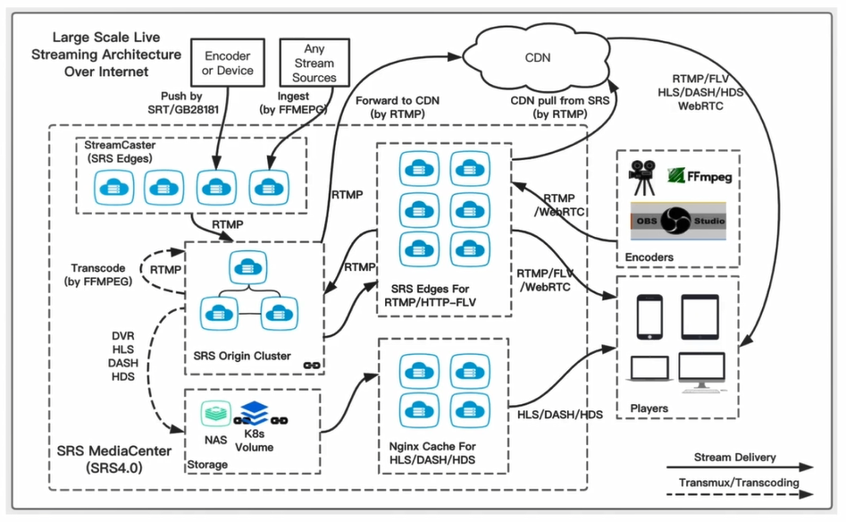
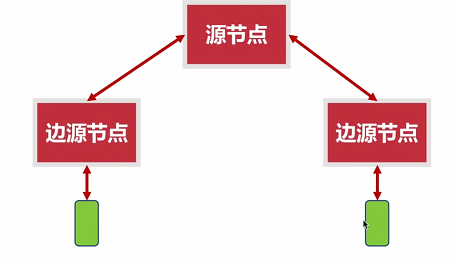
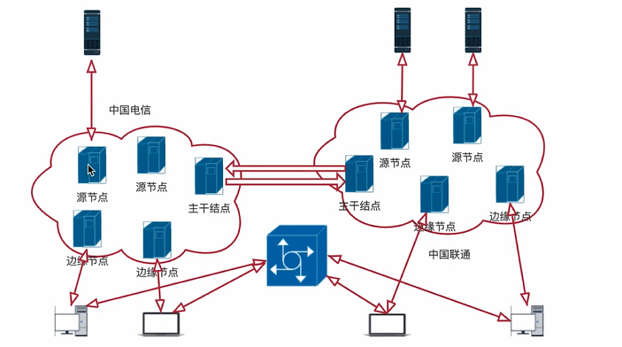
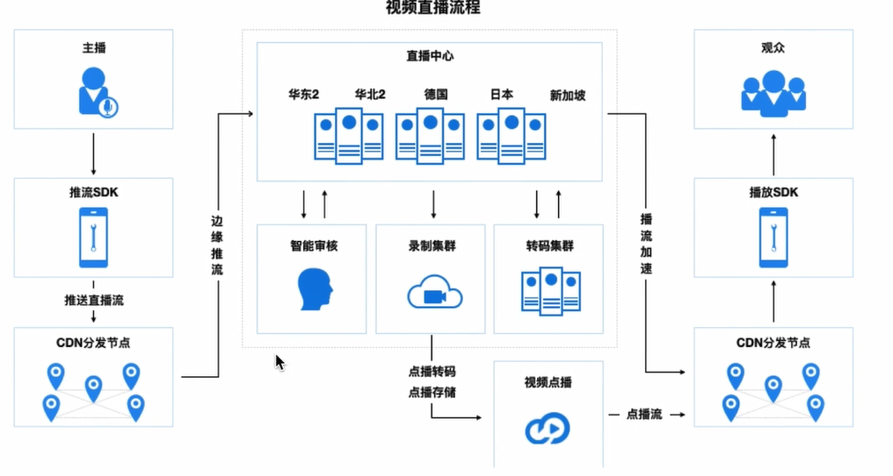
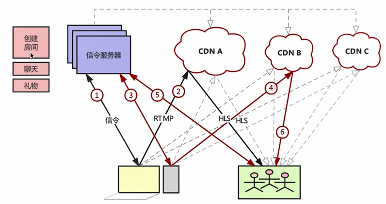
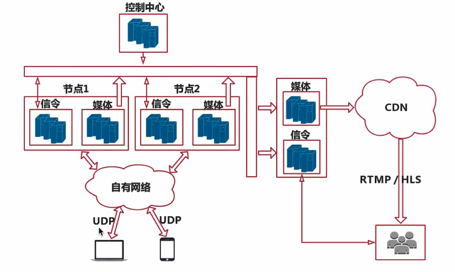
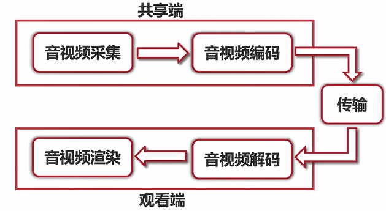
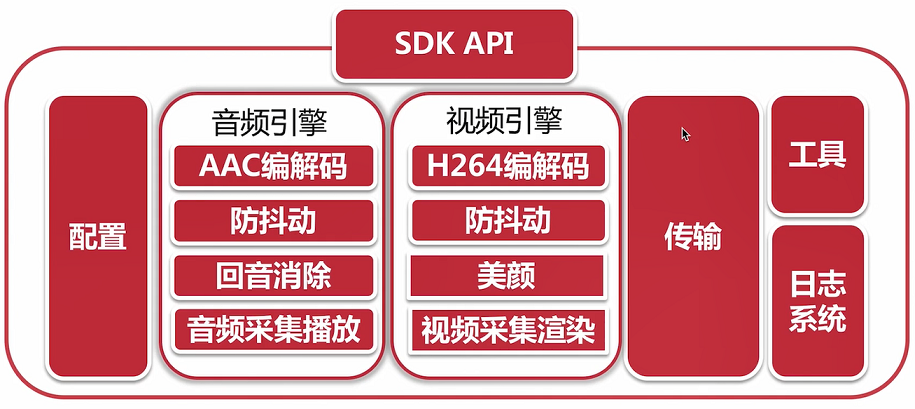

# 流媒体服务器

- [流媒体服务器](#流媒体服务器)
  - [本地搭建 Nginx rtmp 服务器](#本地搭建-nginx-rtmp-服务器)
  - [SRS](#srs)
  - [URL 与 VHOST](#url-与-vhost)
  - [SRS 集群部署](#srs-集群部署)
    - [简单的集群部署](#简单的集群部署)
  - [CDN 网络](#cdn-网络)
    - [阿里云视频直播架构](#阿里云视频直播架构)
    - [阿里云直播](#阿里云直播)
  - [真实的直播架构](#真实的直播架构)

## 本地搭建 Nginx rtmp 服务器

1. 下载源码：[nginx](http://nginx.org/en/download.html)
2. 下载 rtmp 模块：[nginx-rtmp-module](https://github.com/arut/nginx-rtmp-module)
3. 编译安装：

    ```shell
    # nginx 源码目录中
    ./configure --prefix=/build/path/to/there --add-module=/path/to/nginx-rtmp-module
    make
    make install
    ```

4. 根据错误再下载需要的库。
5. 设置 conf/nginx.conf 配置信息。

    ```shell
    # rtmp 服务
    rtmp{
        server{
            # 指定服务端口
            listen 1935;
            chunk_size 4000;

            # 指定流应用
            application live
            {
                live on;
                allow play all;
            }
        }
    }
    ```

6. 使用 ffplay 监听：

    ```shell
    ffplay rtmp://localhost/live/room
    ```

7. 通过 ffmpeg 推流：

    ```shell
    ffmpeg -re -i ~/Video.flv -c copy -f flv rtmp://localhost/live/room
    ```

## SRS

SRS（Simple Rtmp Server），它是单进程实现的，在同一台服务器上可以启动多个进程同时提供服务。它的定位是运营级的互联网直播服务器集群；它提供了非常丰富的节入方案，支持 RTMP、HLS、HTTP-FLV 等。

## URL 与 VHOST

Rtmp URL 格式解析：



VHOST 作用：

1. 支持多客户；
2. 支持多配置；
3. 域名调度；

VHost 对于同一个 IP 地址，可以分配多个不同域名：



## SRS 集群部署



### 简单的集群部署



1. 准备多个服务器，用于各个节点。
2. 登录想要当边缘节点的服务器，配置 SRS ./conf/origin.nocluster.edge.conf 边缘节点配置。

    ```shell
    listen              1935;
    max_connections     1000;
    pid                 objs/edge.pid;
    daemon              off;
    srs_log_tan         console;
    vhost __defaultVhost__{
        cluster{
            mode        remote;
            origin      123.56.135.27:19350; # 源节点信息
        }
    }
    ```

   - 启动边缘节点服务：`srs -c ./conf/origin.nocluster.edge.conf`

3. 登录另一台边缘节点，同样的配置方法。

4. 登录源节点服务器，源站点（123.56.135.27），开启 SRS 服务 ./conf/origin.conf：

    ```shell
    listen              19350;
    max_connections     1000;
    daemon              off;
    srs_log_tan         console;
    pid                 ./objs/origin.pid;
    vhost   __defaultVhost__{
    }
    ```

    - 同样启动源节点服务器：`srs -c ./conf/origin.conf`

5. 再一台电脑上使用 `ffplay rtmp://learningrtc.cn/live/room` 拉流。
6. 通过另外一台电脑使用 ffmpeg 对一个边缘节点的 live/room 进行推流。

## CDN 网络

CDN（Content Delivery Network）：内容分发网络。最初为了实现静态页面的访问加速，通过就近节入的方法解决访问网络资源慢的问题。



### 阿里云视频直播架构

通过终端 SDK 推动到 CND 边缘节点，再到阿里云中心进行转播等等。



### 阿里云直播

1. 注册阿里账户
2. 开通视频直播业务
3. 购买流量资源包
4. 设置推拉流域名
5. 配置 CNAME 域名映射
6. 生成推拉流地址

## 真实的直播架构

CDN 架构图：



实时互动直播架构：



客户端数据流：



直播客户端架构：


