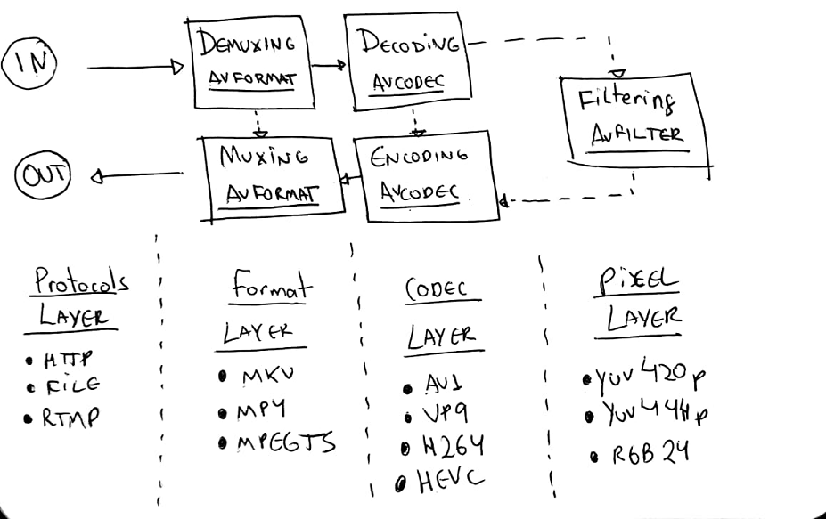
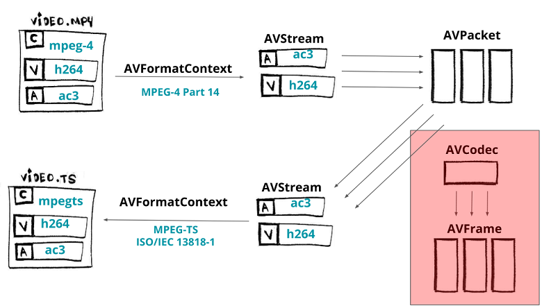

# FFmpeg 重新封装

重新封装的意思就是把一种格式转换为另一种格式。例如：我们可以用 FFmpeg 把 [MPEG-4](https://en.wikipedia.org/wiki/MPEG-4_Part_14) 转换成 [MPEG-TS](https://en.wikipedia.org/wiki/MPEG_transport_stream)。

```bash
ffmpeg input.mp4 -c copy output.ts
```

在不重新编码的情况下（`-c copy`）来对 mp4 做解封装，然后封装为 `mpegts` 文件。如果不用 `-f` 来指定的文件格式的话，ffmpeg 会根据文件扩展名来猜测文件格式。

通常 FFmpeg 工作流或者说是 libav 的工作流如下：

* **[协议层](https://ffmpeg.org/doxygen/trunk/protocols_8c.html)** -  接收输入文件（输入也可以是 rtmp 或者 http）
* **[格式层](https://ffmpeg.org/doxygen/trunk/group__libavf.html)** - 解封装数据内容，暴露出元数据和流信息
* **[编码层](https://ffmpeg.org/doxygen/trunk/group__libavc.html)** - 解码原数据流 <sup>*可选*</sup>
* **[像素层](https://ffmpeg.org/doxygen/trunk/group__lavfi.html)** - 可以对原数据做 filters（像改变大小）<sup>*可选*</sup>

* 然后反过来做相同的操作
* **[编码层](https://ffmpeg.org/doxygen/trunk/group__libavc.html)** - 编码（重新编码或者转码）原数据帧 <sup>*可选*</sup>
* **[格式层](https://ffmpeg.org/doxygen/trunk/group__libavf.html)** - 封装（或接封装）原数据流（压缩数据）
* **[协议层](https://ffmpeg.org/doxygen/trunk/protocols_8c.html)** - 给到相应的 `输出` (文件或者网络数据)



可以使用 libav 实现一个命令行操作： `ffmpeg input.mp4 -c copy output.ts`。

我们读取一个输入文件（`input_format_context`），并且改变为另一个格式的输出（`output_format_context`）。

```cpp
AVFormatContext *input_format_context = NULL;
AVFormatContext *output_format_context = NULL;
```

我们通常的做法就是分配内存并打开一个输入文件。对于这个例子，我们将打开一个文件并为一个输出文件分配内存。

```cpp
if ((ret = avformat_open_input(&input_format_context, in_filename, NULL, NULL)) < 0)
{
    fprintf(stderr, "Could not open input file '%s'", in_filename);
    goto end;
}
if ((ret = avformat_find_stream_info(input_format_context, NULL)) < 0)
{
    fprintf(stderr, "Failed to retrieve input stream information");
    goto end;
}

avformat_alloc_output_context2(&output_format_context, NULL, NULL, out_filename);
if (!output_format_context)
{
    fprintf(stderr, "Could not create output context\n");
    ret = AVERROR_UNKNOWN;
    goto end;
}
```

我们将解封装视频、音频、字幕流，这些变量我们将存入一个数组。

```cpp
number_of_streams = input_format_context->nb_streams;
streams_list = av_mallocz_array(number_of_streams, sizeof(*streams_list));
```

在我们分配完所需要的内存之后，我们遍历所有的流，然后通过 [avformat_new_stream](https://ffmpeg.org/doxygen/trunk/group__lavf__core.html) 为每一个流输入流创建一个对应的输出流。注意我们只针对视频、音频、字幕流。

```cpp
for (i = 0; i < input_format_context->nb_streams; i++)
{
    AVStream* out_stream;
    AVStream* in_stream = input_format_context->streams[i];
    AVCodecParameters* in_codecpar = in_stream->codecpar;
    if (in_codecpar->codec_type != AVMEDIA_TYPE_AUDIO && in_codecpar->codec_type != AVMEDIA_TYPE_VIDEO &&
        in_codecpar->codec_type != AVMEDIA_TYPE_SUBTITLE)
    {
        streams_list[i] = -1;
        continue;
    }
    streams_list[i] = stream_index++;
    out_stream = avformat_new_stream(output_format_context, NULL);
    if (!out_stream)
    {
        fprintf(stderr, "Failed allocating output stream\n");
        ret = AVERROR_UNKNOWN;
        goto end;
    }
    ret = avcodec_parameters_copy(out_stream->codecpar, in_codecpar);
    if (ret < 0)
    {
        fprintf(stderr, "Failed to copy codec parameters\n");
        goto end;
    }
}
```

现在我们创建一个输出文件。

```cpp
if (!(output_format_context->oformat->flags & AVFMT_NOFILE))
{
    ret = avio_open(&output_format_context->pb, out_filename, AVIO_FLAG_WRITE);
    if (ret < 0)
    {
        fprintf(stderr, "Could not open output file '%s'", out_filename);
        goto end;
    }
}

if (fragmented_mp4_options)
{
    // https://developer.mozilla.org/en-US/docs/Web/API/Media_Source_Extensions_API/Transcoding_assets_for_MSE
    av_dict_set(&opts, "movflags", "frag_keyframe+empty_moov+default_base_moof", 0);
}
// https://ffmpeg.org/doxygen/trunk/group__lavf__encoding.html#ga18b7b10bb5b94c4842de18166bc677cb
ret = avformat_write_header(output_format_context, &opts);
if (ret < 0)
{
    fprintf(stderr, "Error occurred when opening output file\n");
    goto end;
}
```

之后，我们把输入数据一个包一个包的复制到输出流。我们循环来读取每一个数据包（`av_read_frame`），对于每一数据包我们都要重新计算 PTS 和 DTS，最终我们通过 `av_interleaved_write_frame` 写入输出格式的上下文。

```cpp
while (1)
{
    AVStream *in_stream, *out_stream;
    ret = av_read_frame(input_format_context, &packet);
    if (ret < 0)
        break;
    in_stream = input_format_context->streams[packet.stream_index];
    if (packet.stream_index >= number_of_streams || streams_list[packet.stream_index] < 0)
    {
        av_packet_unref(&packet);
        continue;
    }

    packet.stream_index = streams_list[packet.stream_index];
    out_stream = output_format_context->streams[packet.stream_index];
    /* copy packet */

    packet.pts = av_rescale_q_rnd(packet.pts, in_stream->time_base, out_stream->time_base,
        static_cast<AVRounding>(AV_ROUND_NEAR_INF | AV_ROUND_PASS_MINMAX));
    packet.dts = av_rescale_q_rnd(packet.dts, in_stream->time_base, out_stream->time_base,
        static_cast<AVRounding>(AV_ROUND_NEAR_INF | AV_ROUND_PASS_MINMAX));

    packet.duration = av_rescale_q(packet.duration, in_stream->time_base, out_stream->time_base);
    // https://ffmpeg.org/doxygen/trunk/structAVPacket.html#ab5793d8195cf4789dfb3913b7a693903
    packet.pos = -1;

    // https://ffmpeg.org/doxygen/trunk/group__lavf__encoding.html#ga37352ed2c63493c38219d935e71db6c1
    ret = av_interleaved_write_frame(output_format_context, &packet);
    if (ret < 0)
    {
        fprintf(stderr, "Error muxing packet\n");
        break;
    }
    av_packet_unref(&packet);
}
```

最后我们要使用函数 [av_write_trailer](https://ffmpeg.org/doxygen/trunk/group__lavf__encoding.html) 把流的结束内容写到输出的媒体文件中。

```cpp
av_write_trailer(output_format_context);
```

生成可执行程序试用下：

```bash
~/WorkSpace/NoteBook_FFmpegLearning/build master*
❯ ./remuxing ../LibFFmpegUsingExample/small_bunny_1080p_60fps.mp4  ./output.ts
Output #0, mpegts, to './output.ts':
    Stream #0:0: Video: h264 (High) (avc1 / 0x31637661), yuv420p, 1920x1080 [SAR 1:1 DAR 16:9], q=2-31, 4773 kb/s
    Stream #0:1: Audio: aac (LC) (mp4a / 0x6134706D), 48000 Hz, 6 channels, fltp, 391 kb/s

~/WorkSpace/NoteBook_FFmpegLearning/build master*
❯ ffprobe output.ts
ffprobe version N-100770-g1775688292 Copyright (c) 2007-2021 the FFmpeg developers
  built with clang version 11.0.0 (https://github.com/llvm/llvm-project.git 0160ad802e899c2922bc9b29564080c22eb0908c)
  configuration: --cc=clang --cxx=c++ --enable-gpl --enable-libass --enable-libx264 --enable-libx265
  libavutil      56. 63.101 / 56. 63.101
  libavcodec     58.117.101 / 58.117.101
  libavformat    58. 65.101 / 58. 65.101
  libavdevice    58. 11.103 / 58. 11.103
  libavfilter     7. 96.100 /  7. 96.100
  libswscale      5.  8.100 /  5.  8.100
  libswresample   3.  8.100 /  3.  8.100
  libpostproc    55.  8.100 / 55.  8.100
Input #0, mpegts, from 'output.ts':
  Duration: 00:00:02.03, start: 0.012000, bitrate: 5335 kb/s
  Program 1
    Metadata:
      service_name    : Service01
      service_provider: FFmpeg
    Stream #0:0[0x100]: Video: h264 (High) ([27][0][0][0] / 0x001B), yuv420p(progressive), 1920x1080 [SAR 1:1 DAR 16:9], 60 fps, 60 tbr, 90k tbn, 120 tbc
    Stream #0:1[0x101]: Audio: aac (LC) ([15][0][0][0] / 0x000F), 48000 Hz, 6 channels, fltp, 393 kb/s
```

总结一下我们在图中所做的事情，我们可以回顾一下 [关于libav如何工作的](./03_FFmpeg库.md#ffmpeg-libav-架)，但我们跳过了编解码器部分。



在我们结束这章之前，我想让大家看看重新封装的过程，你可以将选项传递给封装器。比如我们要分发 [MPEG-DASH](https://developer.mozilla.org/en-US/docs/Web/Apps/Fundamentals/Audio_and_video_delivery/Setting_up_adaptive_streaming_media_sources%23MPEG-DASH_Encoding) 格式的文件，我需要使用 [fragmented mp4](https://stackoverflow.com/questions/35177797/what-exactly-is-fragmented-mp4fmp4-how-is-it-different-from-normal-mp4/35180327#35180327)（有时也叫 fmp4）代替 TS 或者 MPEG-4。

如果用[命令行](https://developer.mozilla.org/en-US/docs/Web/API/Media_Source_Extensions_API/Transcoding_assets_for_MSE%23Fragmenting)我们可以很简单的实现：

```bash
ffmpeg -i non_fragmented.mp4 -movflags frag_keyframe+empty_moov+default_base_moof fragmented.mp4
```

命令行几乎等同于我们调用 libav，当我们写入输出头时，在复制数据包之前只需要传入相应的选项就可以了。

```cpp
AVDictionary* opts = NULL;
av_dict_set(&opts, "movflags", "frag_keyframe+empty_moov+default_base_moof", 0);
ret = avformat_write_header(output_format_context, &opts);
```

现在我们生成 fragmented mp4 文件：

```bash
make run_remuxing_fragmented_mp4
```

为了确保我没有骗你们。你可以一个非常棒的工具 [gpac/mp4box.js](http://download.tsi.telecom-paristech.fr/gpac/mp4box.js/filereader.html)，或者在线工具 [http://mp4parser.com/](http://mp4parser.com/) 去对比差异。


如你所见， `mdat` atom/box 是**存放音视频帧的地方**。现在我们加载 mp4 分片，看看是如何渲染 `mdat` 的。
